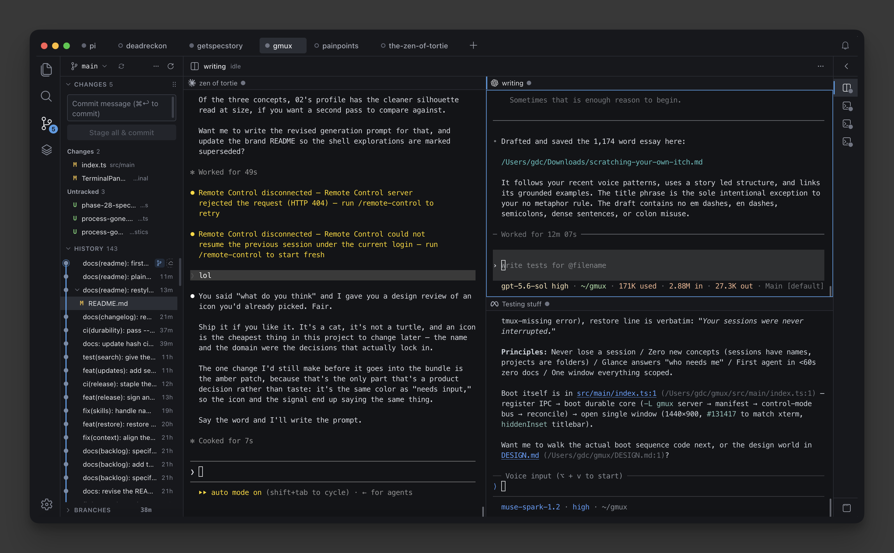

  

<h1 align="center">Tortie</h1>

<b>A calm agent multiplexer with familiar IDE features, for macOS.</b>

  

  
  
  
  
  

---

If you run coding agents in VS Code or Cursor terminals, but you're tired of
cmd+\`'ing between windows and losing running agents to every restart,
Tortie is for you. I built it to scratch my own itch. I don't want an agent
super app, and I don't want to think about tmux. I just want all of my
projects in one window and be able to easily organize and not lose my agent
sessions.

  

## Features

### Durable agent sessions

- **Quit the app and the agents keep working.** Sessions live outside the app process, so the window is just a view.
- **Reboot and everything comes back.** Scrollback replayed, and each agent's own resume command typed and waiting for your Enter.
- **Your session list keeps verified backups of itself,** refreshed automatically as it changes.
- **If a session didn't come back, Tortie says so.** No green dot on a dead session.

### One window for your projects

- **Every project is a tab.** Switch with `⌘1` through `⌘9`, and each tab scopes its own sessions, git state, tree and editor.
- **See who needs you at a glance.** Status dots on every session, and `⌘J` jumps to whichever one is waiting on you.
- **Split, zoom and drag.** Drop one session onto another to split, zoom any pane, drag an image from the tree into an agent.
- **Nothing new to learn.** Sessions have names. No prefix keys, no detach commands, no config files.

### The agents

- **Twelve agents supported out of the box.** Claude Code, Codex, Cursor, Gemini, Qwen, Muse, Pi, CodeWhale, Antigravity, Droid and plain shells, each with its own icon, hotkey and launch flags.
- **Add your own with one JSON file.** No rebuild, nothing in the file runs as code, and anything that could start a process asks you first.
- **See what your agents actually load.** The Context view lists every skill, MCP server, hook, plugin and instruction file on your machine, per agent, and installs skills from GitHub.
- **Conversations are captured.** The bundled SpecStory integration records each session's conversation as it happens.

### Familiar IDE features

- **A full git sidebar.** Staging, history, branches and a commit graph, built from VS Code's own parsers.
- **Click a file, see the diff.** Monaco opens modified files as a diff against HEAD by default, and plain editing is one toggle away.
- **A decorated file tree** with git status colors and the icons you are used to.
- **Search everything at once.** ripgrep across every open project, fast on large trees.
- **Rich previews.** Markdown and HTML render in place. Untrusted pages open in a sandboxed frame with no scripts and no network.

## What Tortie refuses to do

- It never touches your own tmux server or `~/.tmux.conf`.
- It never adopts a terminal session it did not create.
- It never renders a key file or anything that looks like a secret as a friendly preview.
- It never runs third party plugin code inside its own processes. Adding an agent is configuration, not code.

## Install

macOS on Apple silicon. Nothing has to be installed first. Tortie carries its
own copy of tmux, so a fresh Mac needs no Homebrew and no command line setup.

1. [Download the latest release](https://github.com/gregce/tortie/releases/latest) and open the DMG.
2. Drag **Tortie** to Applications and open it.
3. Point it at a project folder. A git repository gets the full sidebar; any folder works.

## Built with

Tortie is deliberately assembled from open source rather than written from
scratch. The code it owns is the durability layer and the glue.

- [tmux](https://github.com/tmux/tmux) holds the sessions. It is the reason your agents survive. Tortie ships its own copy, so the version is chosen by the release and not by whatever the machine happens to have.
- [Electron](https://www.electronjs.org/) is the window.
- [xterm.js](https://github.com/xtermjs/xterm.js) draws the terminals.
- [Monaco](https://github.com/microsoft/monaco-editor) is the editor, the same one inside VS Code.
- [Pierre](https://pierre.co/)'s [@pierre/trees](https://www.npmjs.com/package/@pierre/trees) and [@pierre/diffs](https://www.npmjs.com/package/@pierre/diffs) render the file tree and the diffs.
- [ripgrep](https://github.com/BurntSushi/ripgrep) runs the search.
- [VS Code](https://github.com/microsoft/vscode) is the source of the vendored git parsers, fuzzy scorer, commit graph layout and [codicons](https://github.com/microsoft/vscode-codicons), all with attribution.
- [material-icon-theme](https://github.com/material-extensions/vscode-material-icon-theme) supplies the file icons.
- [better-sqlite3](https://github.com/WiseLibs/better-sqlite3) stores the session manifest.
- [node-pty](https://github.com/microsoft/node-pty) connects the shells.
- [skills.sh](https://skills.sh) installs and manages the skills behind the Context view.
- [SpecStory](https://specstory.com/) captures agent conversations.

The full list with licenses is in [`NOTICE`](NOTICE).

## More

- Philosophy: [`docs/ZEN-OF-TORTIE.md`](docs/ZEN-OF-TORTIE.md)
- Release notes: [`CHANGELOG.md`](CHANGELOG.md)
- Building from source and contributing: [`DEVELOPMENT.md`](DEVELOPMENT.md)
- License: Apache 2.0, see [`LICENSE`](LICENSE) and [`NOTICE`](NOTICE)

Made by <a href="https://github.com/gregce">gregce</a>. <i>The sessions were never interrupted.</i>

