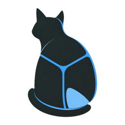
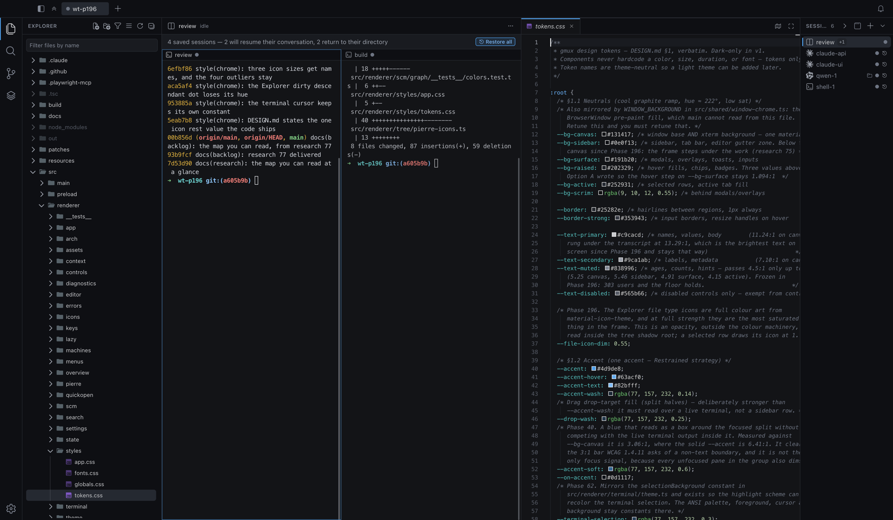
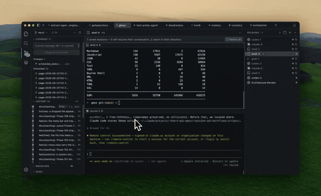
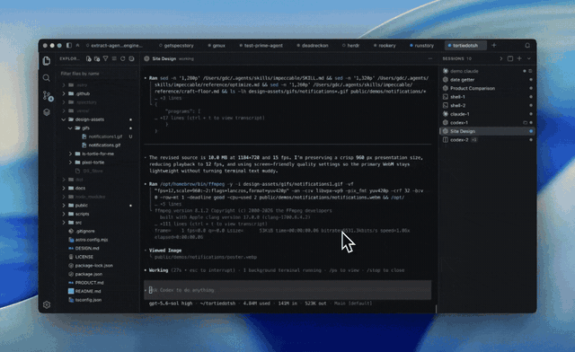
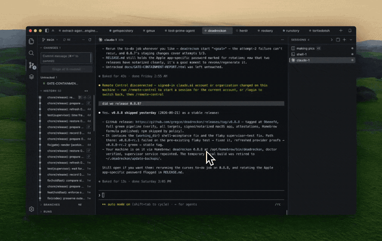
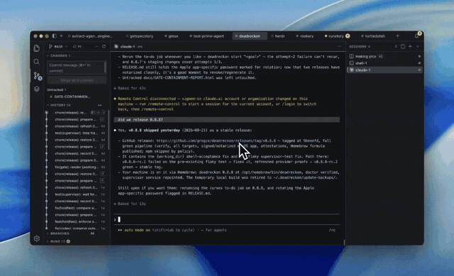
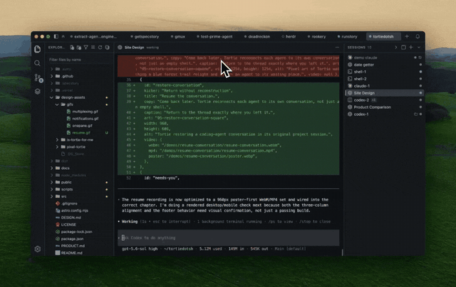

  

<h1 align="center">Tortie</h1>

<b>A calm agent multiplexer with familiar IDE features, for macOS.</b>

  
  

  
  
  
  
  

---

If you run coding agents in VS Code or Cursor terminals, but you're tired of
cmd+\`'ing between windows and losing running agents to every restart,
Tortie is for you. I built it to scratch my own itch. I don't want an agent
super app, and I don't want to think about tmux. I just want all of my
projects in one window and be able to easily organize and not lose my agent
sessions.

  

<a href="https://tortie.sh"><strong>Explore Tortie, read the docs and compare agent tools at tortie.sh →</strong></a>

## Key features

<table>
<tr>
<td width="45%" valign="middle">

### One window for every project

Every project is a tab with its own sessions, Git state, file tree and editor. Use <kbd>⌘P</kbd> to find files in the active project or across every open project.

[Docs →](https://tortie.sh/docs/projects-and-sessions/#projects)

</td>
<td width="55%">
  
</td>
</tr>
<tr>
<td width="45%" valign="middle">

### Agents keep working

Quit Tortie without stopping the work. Named sessions run outside the app window and return when you reopen it.

[Docs →](https://tortie.sh/docs/durability-and-recovery/#quit)

</td>
<td width="55%">
  
</td>
</tr>
<tr>
<td width="45%" valign="middle">

### Resume the conversation

After a restart, Tortie replays the scrollback and prepares each agent's own resume command. You choose when to reconnect the conversation.

[Docs →](https://tortie.sh/docs/durability-and-recovery/#reboot)

</td>
<td width="55%">
  
</td>
</tr>
<tr>
<td width="45%" valign="middle">

### Jump to what needs you

Working agents stay quiet. Press <kbd>⌘J</kbd> to jump to the session waiting for input, even when another project is open.

[Docs →](https://tortie.sh/docs/attention-and-catch-me-up/#needs-input)

</td>
<td width="55%">
  
</td>
</tr>
<tr>
<td width="45%" valign="middle">

### Catch Me Up

Press <kbd>⇧⌘U</kbd> to see every session in a project at a glance. Open one to read your asks and the agent's closing answers from its own log, then jump back to any exchange.

The conversation stays word for word. An optional model can write only the one-line project summary.

[Docs →](https://tortie.sh/docs/attention-and-catch-me-up/#catch-me-up)

</td>
<td width="55%">
  
</td>
</tr>
</table>

## Supported agents

Tortie includes **13 built-in profiles**: 11 CLI agents you can run in durable sessions, plus capture-only support for Cursor IDE and VS Code Copilot.

  <a href="https://code.claude.com/docs/en/setup"><kbd> Claude Code</kbd></a> &nbsp;
  <a href="https://learn.chatgpt.com/docs/codex/cli"><kbd> Codex</kbd></a> &nbsp;
  <a href="https://cursor.com/docs/cli/installation"><kbd> Cursor CLI</kbd></a> &nbsp;
  <a href="https://geminicli.com/docs/get-started/installation"><kbd> Gemini CLI</kbd></a> &nbsp;
  <a href="https://github.com/QwenLM/qwen-code"><kbd> Qwen Code</kbd></a> &nbsp;
  <a href="https://tortie.sh/docs/supported-agents/#launchable-agents"><kbd> Muse Code</kbd></a> &nbsp;
  <a href="https://pi.dev"><kbd> Pi</kbd></a> &nbsp;
  <a href="https://github.com/Hmbown/CodeWhale"><kbd> CodeWhale</kbd></a> &nbsp;
  <a href="https://antigravity.google/docs/cli/install"><kbd> Antigravity</kbd></a> &nbsp;
  <a href="https://docs.factory.ai/cli/getting-started/quickstart"><kbd> Droid</kbd></a> &nbsp;
  <a href="https://x.ai"><kbd> Grok</kbd></a> &nbsp;
  <a href="https://cursor.com"><kbd> Cursor IDE</kbd></a> &nbsp;
  <a href="https://code.visualstudio.com/docs/copilot/overview"><kbd> VS Code Copilot</kbd></a>

[See launch, resume and conversation support for every agent →](https://tortie.sh/docs/supported-agents/#launchable-agents)

Need another CLI? [Add it with one JSON file](https://github.com/gregce/tortie/blob/main/resources/config/README.md)—no rebuild required. Tortie asks before a new definition starts a process. The bundled SpecStory integration can capture supported conversations as Markdown.

## Other features

### Familiar IDE features

- **A full Git sidebar.** Stage, commit, browse branches and history, and inspect a rich commit graph built from VS Code's parsers. See GitHub Actions runs when the GitHub CLI is installed.
- **Click a file, see the diff.** Monaco opens modified files as a diff against HEAD by default, and plain editing is a toggle away.
- **A decorated file tree.** See Git status colors and familiar file icons, then drag files in from Finder or out to another app.
- **Search everything at once.** ripgrep across every open project, fast on large trees.
- **Rich previews.** Markdown and HTML render in place. Untrusted pages open in a sandboxed frame with no scripts and no network.
- **Context for every agent.** See each agent's skills, MCP servers, hooks, plugins and instruction files, and install skills through Skills.sh.

### Remote machines (early)

- **Open a folder on another Mac as a project tab.** Add the machine in Settings. Tailscale works out of the box. The file tree, search, `⌘P`, Git sidebar and GitHub Actions runs all read from that machine.
- **Run agents there.** Start a session on the machine, see what is already running, and get it back after a restart with its resume command waiting.
- **Editing is off until you switch it on.** Pick one folder per machine in Settings. Tortie writes only under it. You get save, new folder and rename. There is no undo.
- **Nothing gets installed over there.** Tortie uses that machine's tmux over ssh, and can make and install a key for you.

Early because it has only been tested against Macs. The machine needs ssh, Remote Login on and tmux. Nothing in the code turns a Linux host away and the scripts handle both BSD and GNU tools, so a Linux VM should work, but has not been fully tested.

## What Tortie does not do

- It does not touch your own tmux server or `~/.tmux.conf`, on this Mac or on a machine you add.
- It does not render a key file or anything that looks like a secret as a friendly preview.
- It does not run third-party plugin code inside its own processes. Adding an agent is configuration, not code.

## Install

macOS on Apple silicon. Nothing has to be installed first. Tortie carries its
own copy of tmux, so a fresh Mac needs no Homebrew and no command line setup.

1. [Download the latest release](https://github.com/gregce/tortie/releases/latest) and open the DMG.
2. Drag **Tortie** to Applications and open it.
3. Point it at a project folder. A git repository gets the full sidebar; any folder works.

## Built with

Tortie is deliberately assembled from open source rather than written from
scratch. The code it owns is the durability layer and the glue.

- [tmux](https://github.com/tmux/tmux) holds the sessions. It is the reason your agents survive. Tortie ships its own copy, so the version is chosen by the release and not by whatever the machine happens to have.
- [Electron](https://www.electronjs.org/) is the window.
- [xterm.js](https://github.com/xtermjs/xterm.js) draws the terminals.
- [Monaco](https://github.com/microsoft/monaco-editor) is the editor, the same one inside VS Code.
- [Pierre](https://pierre.co/)'s [@pierre/trees](https://www.npmjs.com/package/@pierre/trees) and [@pierre/diffs](https://www.npmjs.com/package/@pierre/diffs) render the file tree and the diffs.
- [ripgrep](https://github.com/BurntSushi/ripgrep) runs the search.
- [VS Code](https://github.com/microsoft/vscode) is the source of the vendored git parsers, fuzzy scorer, commit graph layout and [codicons](https://github.com/microsoft/vscode-codicons), all with attribution.
- [material-icon-theme](https://github.com/material-extensions/vscode-material-icon-theme) supplies the file icons.
- [better-sqlite3](https://github.com/WiseLibs/better-sqlite3) stores the session manifest.
- [node-pty](https://github.com/microsoft/node-pty) connects the shells.
- [skills.sh](https://skills.sh) installs and manages the skills behind the Context view.
- [SpecStory](https://specstory.com/) captures agent conversations.

The full list with licenses is in [`NOTICE`](NOTICE).

## More

- Philosophy: [`docs/ZEN-OF-TORTIE.md`](docs/ZEN-OF-TORTIE.md)
- Release notes: [`CHANGELOG.md`](CHANGELOG.md)
- Building from source and contributing: [`DEVELOPMENT.md`](DEVELOPMENT.md)
- License: Apache 2.0, see [`LICENSE`](LICENSE) and [`NOTICE`](NOTICE)

Tortie is not affiliated with, endorsed by, or sponsored by any of the companies whose products it launches. All product names and logos are the property of their respective owners, and are used here only to identify the supported product.

<a href="https://tortie.sh/docs/">Read the Tortie product documentation →</a>

Made by <a href="https://github.com/gregce">gregce</a>. <i>Your sessions are never interrupted.</i>

