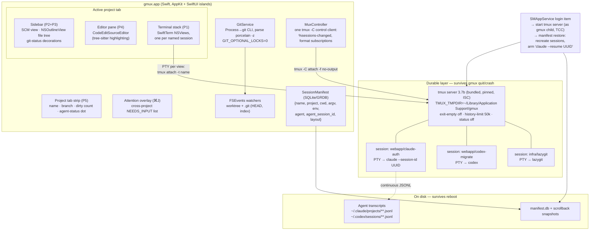

# Design B — gmux as a Native macOS App (Swift + AppKit/SwiftUI)

**Date:** 2026-08-09
**Status:** Candidate design (one of several)
**One-liner:** A Ghostty-class native Mac shell — SwiftTerm views attached to a bundled, pinned tmux server for bulletproof session durability, a git-CLI-driven SCM sidebar, an NSOutlineView file tree, and a CodeEditSourceEditor editor pane — trading the web stack's component maturity for a 10× lighter, truly Mac-native app.

All factual claims below are grounded in the gmux research corpus (`docs/research/01`–`10`, all verified against live sources on 2026-08-09) with inline citations to the specific research doc and its primary sources.

---

## 1. Design summary

gmux is a single-window AppKit/SwiftUI application. The window's spine is a strip of **project tabs** (one tab = one repo checkout). Inside each tab: a left sidebar (branch header + SCM view + git-decorated file tree), a center editor pane opened on file click, and a right stack of **named, durable terminal sessions** (research 10, Layout C).

The load-bearing architectural decision: **the GUI owns no processes.** Every terminal session is a named session on a dedicated, bundled **tmux** server running on a private socket. gmux's SwiftTerm views are thin clients (`tmux attach -t <name>`); a single tmux control-mode (`-C`) client is the event bus. The app can crash, update, or be quit — the agents keep running. Reboot survival is gmux's own **session manifest** replaying `claude --resume <uuid>` / `codex resume <id>` per named session (research 01, 02, 09).

This is the architecture iTerm2 proved for a decade (GUI renders, tmux persists — research 01 §3.2) combined with the manifest-resume pattern cmux ships today in exactly this stack (Swift + AppKit + native terminal, "survives a full computer restart"; research 04 §3.4) — plus the IDE furniture (P2–P4) that no terminal-first app has.

---

## 2. Architecture

Three process domains, three failure tiers (research 09):

| Tier | Event | What survives | Mechanism |
|---|---|---|---|
| T1 | gmux quits / crashes / updates | Everything: agent processes, PTYs, scrollback, names | tmux server is a separate daemon; gmux just reattaches |
| T2 | tmux server dies (rare) | Agent conversations (on disk), manifest | Manifest recreate + agent `--resume` |
| T3 | Machine reboots | Agent conversations, manifest, scrollback snapshots | SMAppService login item → manifest restore → armed resume |

---

## 3. Exact OSS components and licenses

| Component | Role | License | State (verified 2026-08-09) | Research doc |
|---|---|---|---|---|
| **tmux 3.7b** (bundled, pinned, private socket) | Durability layer: owns every PTY | **ISC** (bundle-friendly) | Released 2026-07-01; commits within days; iTerm2 proves GUI-backend viability for 10+ yrs | 01 §3, 09 §A |
| **SwiftTerm v1.16.0** | Terminal NSView + PTY (`LocalProcessTerminalView`) | **MIT** | Released 2026-08-07 (active weekly); ships in Secure Shellfish, La Terminal, CodeEdit; OSC 8 + deep OSC 133 (incl. click-to-move-cursor) + real `NSTextInputClient` IME | 05 §3 |
| **git CLI** (user's / Xcode CLT) | All SCM operations, spawned via `Process` | GPLv2 — *irrelevant*: process invocation, not linking | Evergreen; the approach VS Code, GitHub Desktop, SourceGit, lazygit all use | 06 §1, §2.3 |
| **lazygit v0.64.0** | Optional "git power pane" in a durable tmux session | **MIT** | v0.64.0 2026-08-04, monthly releases | 06 §3.2 |
| **CodeEditSourceEditor v0.15.x + CodeEditTextView v0.12.x + CodeEditLanguages** | Editor pane: tree-sitter highlighting, find/replace, minimap | **MIT** | v0.15.2 2025-09-16, pushed 2026-04-20; pre-1.0, README says "not ready for production use" — accepted risk, see §9 | 07 §2.1 |
| **swift-tree-sitter** (official `tree-sitter/swift-tree-sitter`) + **Neon** (ChimeHQ) | Fallback highlighting substrate if we outgrow CodeEdit's editor | **BSD-3-Clause** both | swift-tree-sitter pushed 2026-08-05 (now first-party upstream); Neon pushed 2026-04-18 | 07 §2.4 |
| **NSOutlineView / FSEvents / SMAppService** | File tree, watching, login item | Platform SDK | Evergreen | 07 §2.5, 09 §C.1 |
| **Sparkle 2.9.5** | Auto-update | MIT-style | 2.8.0 added Tahoe support; actively maintained | 08 §6 |
| **GRDB.swift** (or raw SQLite3) | Session manifest store | **MIT** | Active | — (agent-deck's SQLite schema is the model, 04 §3.8) |
| *Rejected:* STTextView | best-maintained native text view | **GPLv3 / paid commercial** — viral for gmux | v2.3.12 2026-08-01 | 07 §2.2 |
| *Rejected (for now):* libghostty | future terminal engine | MIT | Embedding API "not yet stabilized for general-purpose embedding," untagged, Zig build required; Swift framework demoed Dec 2025 but still alpha/coming — **re-evaluate for gmux 2.0** | 03 §Ghostty, 05 §4, 08 §3 |
| *Rejected:* SwiftGit2 / objective-git | libgit2 bindings | MIT | SwiftGit2 low bus factor (last push 2025-11-24); objective-git dormant since 2023 | 06 §2.3 |
| *Rejected:* zellij | alternative mux | MIT | Active, but **no control mode / external rendering protocol** (open issue zellij#3965) — see §5 | 01 §4 |

License posture: everything shipped inside gmux.app is ISC/MIT/BSD-3/platform. No GPL/AGPL code is linked (git and lazygit are invoked as separate processes, which carries no copyleft obligation). cmux (GPL-3.0) and iTerm2 (GPL-2.0) are read for architecture only, never copied.

---

## 4. How each property is satisfied

### P1 — Durable named sessions (the killer feature, full lifecycle)

**Identity.** A gmux terminal's user-visible name *is* the tmux session name (namespaced `<project>/<name>`, e.g. `webapp/claude-auth`). Names are first-class in tmux — enumerable (`tmux ls -F '#{session_name}'`), renameable, persistent inside the server (research 01 §3.1). gmux mirrors metadata into tmux **user options** (`@gmux-agent`, `@gmux-session-id`) so the durable server is self-describing, and into the manifest so disk is too.

**Create (E.0).** `New session "auth-refactor" in webapp with Claude` ⇒

1. gmux generates UUID, writes manifest row `{name, project, cwd, argv: ["claude","--session-id","<uuid>"], agent: "claude-code", agent_session_id: <uuid>, ...}`.
2. `tmux new-session -d -s "webapp/auth-refactor" -c ~/src/webapp` then launches the agent with the pre-assigned ID — Claude Code's `--session-id <uuid>` makes future resume deterministic with zero parsing (research 02, [CLI reference](https://code.claude.com/docs/en/cli-reference)). For Codex (no pre-assignment), an FSEvents watch on `~/.codex/sessions/**` harvests the rollout UUID created just after spawn; cursor-agent uses `create-chat`; Amp uses `threads new` (research 02 matrix).
3. A SwiftTerm view spawns a PTY running `tmux attach -t "webapp/auth-refactor"` against gmux's private socket. tmux chrome is fully disabled in `gmux-tmux.conf` (`status off`, `prefix None`, `history-limit 50000`, `exit-empty off`, `destroy-unattached off`), so the user sees only the agent.

**App restart / crash (T1) — true reattach, zero loss.** gmux relaunches → pings/starts the server → `tmux ls -F ...` → reconciles against the manifest → reattaches SwiftTerm views. The agent PID is unchanged; output produced while gmux was closed is in the server's scrollback and is backfilled instantly via `capture-pane -p -e -J -S -` (full history, colors preserved; research 09 §A.3). UX label: *"your sessions were never interrupted."* This is the mechanism, not a promise: iTerm2's `-CC` integration and every tmux user on earth exercise it daily (research 01 §10).

**Reboot (T3) — restore + relaunch.** Processes cannot survive a reboot (research 01 §1); the honest mechanism is reconstruction, and gmux does it better than any generic tool because it *is the launcher*:

1. **SMAppService login item** (macOS 13+; user-visible in System Settings) starts gmux (or headless `gmux-agentd`) at login (research 09 §C.1).
2. gmux spawns its tmux server **as its own child** — critical for TCC attribution, see risk #3 — with `TMUX_TMPDIR=~/Library/Application Support/gmux` (dodges macOS `/tmp` cleanup killing the socket; research 09 §C.4).
3. For each manifest row: `tmux new-session -d -s <name> -c <cwd>`; re-split from stored `#{window_layout}` + `select-layout`; if a scrollback snapshot exists, launch the pane as `cat <snapshot>; exec $SHELL` so prior output is inert history above a fresh prompt (tmux-resurrect's trick — steal the design, not the dormant plugin; research 09 §B.1–B.2).
4. Re-launch each agent via its **recorded resume command** — `claude --resume <uuid>` (works cross-directory since v2.1.223), `codex resume <id>`, `cursor-agent --resume=<id>`, `amp threads continue <id>`, `aider --restore-chat-history` — with the recorded cwd and re-passed flags (Claude explicitly does not restore `--mcp-config`/`--add-dir`; research 02).
5. **Default policy: armed, not auto-run** — the resume command is pre-typed in the pane (zellij's ENTER-to-run UX); auto-resume is per-session opt-in. Ten agents silently re-reading 150k-token transcripts is real money and surprise (research 02 §Bottom line, 09 §B.4).

Snapshot cadence is event-driven (manifest updated on `%sessions-changed` / `%session-renamed` control-mode notifications; cwd/layout refreshed via `refresh-client -B` format subscriptions), plus timed `capture-pane` text snapshots and one on `applicationWillTerminate` (research 09 §B.4).

**What's honestly lost per tier** (shown in UI, VS Code-style): T1 — nothing. T3 — the process itself, interactively accumulated shell env (venvs, ssh-agent), and in-flight tool-call side effects; the conversation, names, layout, cwd, and scrollback text all come back (research 09 §E).

**Acceptance tests** (from research 09, adopted as the P1 definition of done): `kill -9` gmux → same agent PID on relaunch; quit 30 min while agent works → detached output visible; reboot mid-conversation → session restored in cwd with armed resume showing full history; 12 sessions / 3 projects restore < 5 s; TCC self-test passes; server socket reachable after 7 days uptime; `tmux kill-server` → T2 restore offered.

### P2 — Git GUI (VS Code SCM grade)

Native SwiftUI sidebar backed by a `GitService` that **spawns the git CLI** — the same design as VS Code's own MIT `extensions/git` (which is a `cp.spawn` wrapper, not libgit2), GitHub Desktop, SourceGit, and lazygit (research 06 §1). VS Code's `git.ts`/`GitStatusParser`/`parseGitCommits` serve as an exact spec for the ~6 commands needed:

- Branch + ahead/behind + all file states: **one call**, `git status --porcelain=v2 --branch -z` — feeds the always-visible branch header, the four resource groups (Merge/Staged/Changes/Untracked), *and* P3's decorations.
- Stage/unstage: `git add -- 
` / `git restore --staged -- 
`. Commit: `git commit -F <file>` (inherits the user's hooks and signing — something libgit2 would silently skip).
- History + copy-SHA: `git log --format=%H%x00%h%x00%an%x00%at%x00%s -z -n 200`; full SHA is field one, copy-SHA is a row action writing to `NSPasteboard`.
- All background reads run with `GIT_OPTIONAL_LOCKS=0` so gmux never fights the agents' own git commands for the index lock — for this product's audience that's a *safety* feature, not an optimization (research 06 §2 conclusion).
- Refresh: two FSEvents streams per repo (worktree excluding `.git/`; `.git` itself excluding `index.lock`, with `.git/HEAD` driving instant branch updates), throttled status, ~500 ms debounced decoration repaint, `statusLimit`-style huge-repo guard — VS Code's exact recipe (research 06 §1.2). One-click `git config core.fsmonitor true` keeps status sub-100 ms under agent churn (git ≥2.37 FSEvents daemon; research 06 §4.2).
- **Escape hatch that plays to this design's strength:** a per-project **lazygit pane** as a durable tmux session — line-level staging, interactive rebase, stash, bisect for ~zero integration code, exceeding VS Code SCM depth (research 06 §3.2). Command configurable (lazygit/gitu/gitui, all MIT).

Honest cost note: the sidebar *views* (groups, rows, diff-on-click presentation, history list) are hand-built SwiftUI — there is no reusable native SCM component (research 08 matrix scores native 2/5 here). The *plumbing* is small and fully specified; the views are ~2–3 weeks of native UI work that Electron would get closer to free.

### P3 — File explorer with git decorations

`NSOutlineView` (lazy children — the same widget Finder/Xcode use, cheap at 100k files) wrapped for SwiftUI. Decorations are a path → (badge letter, color) map published by `GitService` after each status run, with parent-folder propagation — a direct port of VS Code's `decorationProvider.ts` model (M/A/D/R/U + modified/added/untracked colors; research 06 §1.3, 07 §2.5). No third-party Swift tree package exists worth taking; this is ~1–2 weeks of well-understood work (research 07 §2.5).

### P4 — Click-to-view/edit

**CodeEditSourceEditor + CodeEditTextView + CodeEditLanguages** (all MIT): tree-sitter highlighting with prebuilt grammars for gmux's language set, find/replace, minimap, themes — the most complete drop-in native editor view that exists (research 07 §2.1). Click a file in the tree → opens in the center pane; edit; ⌘S saves.

Being honest per the brief: **this is where native pays its bill.**

- CodeEdit's packages are pre-1.0 with breaking minor releases and a self-declared "not production ready" README. Mitigation: pin versions, vendor if needed, and keep **Neon + official swift-tree-sitter (BSD-3)** as the substrate to rebuild on if we outgrow it (research 07 §2.4, bottom line).
- **No native diff view exists.** Monaco/CodeMirror ship VS Code-quality diffs free; on this path the "glance at what the agent changed" gesture is DIY. Design B's scoping answer: (a) MVP renders **unified diffs** (`git diff -- 
` output) in a purpose-built read-only view — gutter-colored added/removed lines on CodeEditTextView, a well-bounded ~1–2 week component; (b) side-by-side diff is full-scope, budgeted at +2–3 weeks; (c) the lazygit pane and terminal `git diff` cover the gap meanwhile. Research 07 prices the whole native P4 delta at **3–6 extra weeks vs the web stack** — that estimate is adopted in §8.
- STTextView is technically the best-maintained native text view but is GPLv3-or-commercial; it is excluded unless a license is purchased (research 07 §2.2).

### P5 — Multi-project tabs in one window

One `NSWindow`; a custom tab strip (research 10, Layout C — *not* macOS native window tabs, which are per-window Spaces-style tabs with no room for status chrome). One tab = one project = one repo checkout; each tab shows name, optional color, current branch, dirty-count roll-up, and an agent-status dot with a needs-input numeral. Opening an already-open project focuses its tab (Zed's idempotent open). Everything inside a tab — terminals, SCM, tree, editor — is scoped to that project, the exact isolation VS Code's tracker shows users requesting and being refused (vscode#322745; research 10 §2.2). A ⌘J **attention overlay** lists NEEDS_INPUT sessions across all projects and jumps to tab+session; state comes from the layered detector: Claude Code `Notification`/`Stop` hooks and Codex `notify` → BEL/OSC 9 (SwiftTerm sees these natively) → OSC 133 prompt marks (SwiftTerm has first-class support) → content-silence heuristic (research 10 §6).

### P6 — Lightweight

This is Design B's decisive win, with measured numbers: native terminals idle at **24–45 MB (Ghostty)** vs iTerm2's 78–185 MB, Warp's ~340 MB, and Wave's 400–800 MB in-use Electron reality; a single-window Electron gmux realistically lands at 250–400 MB baseline (research 08 §2). Design B's realistic envelope: **gmux.app well under ~150 MB RSS with 10+ live sessions**, since backgrounded SwiftTerm views don't draw, the tmux server holds scrollback out-of-process, and there's no Chromium/Node runtime at all. PTY→screen has **no IPC boundary** — SwiftTerm reads the fd on a DispatchQueue straight into the view, so the entire xterm.js flow-control problem class evaporates (research 08 §4). Cold start is native-instant; battery behavior is AppKit/Metal, not a bundled browser.

---

## 5. Durability layer decision: tmux control mode vs zellij vs own PTY host

**Chosen: bundled, pinned tmux on a private socket — hybrid integration (plain `attach` for rendering + one `-C` client for events), graduating to `-CC` only if ever needed.** This mirrors research 01's bottom line exactly.

| Criterion | tmux (chosen) | zellij | Own PTY-host daemon (Swift) |
|---|---|---|---|
| GUI-renderable event/output protocol | ✅ Control mode: `%output`, `%sessions-changed`, format subscriptions, `pause-after` flow control — designed for iTerm2, 10 yrs in production | ❌ None; open unassigned feature request ([zellij#3965](https://github.com/zellij-org/zellij/issues/3965)); a GUI drives it blind through its TUI | ✅ You define it — and build all of it |
| Named sessions, machine-readable introspection | ✅ CLI + `-F` formats (~300 vars) + user options for metadata | ⚠️ CLI only, less introspection | ✅ DIY |
| Scrollback held server-side, queryable | ✅ `history-limit` + `capture-pane -e -J -S -` | ⚠️ Internal; serialization opt-in | ⚠️ You implement a headless buffer replica (VS Code needed `@xterm/headless` for this; Swift has no equivalent off-the-shelf) |
| T1 survival | ✅ By construction | ✅ | ✅ if the daemon is correct — single point of failure you own |
| T3 primitives | resurrect/continuum precedent; better done app-level (chosen anyway) | Built-in serialization — but restores a *shell*, not the agent conversation, and ps-sniffing is documented-flaky (#4129, #4873, #2925) | App-level manifest either way |
| Proven as embedded GUI backend | ✅ iTerm2 since ~2013 | ❌ (cmux attempting, unproven) | ❌ Zed's pty-host is an unimplemented RFC (#50584); wmux proves it in Node, not Swift |
| License / bundling | ISC — bundle a pinned binary, kill version skew | MIT | n/a |
| Maintenance (Aug 2026) | 3.7b Jul 2026, commits this week | Active | You are the maintainer |

**Rationale.** (1) The only two projects that ever made "external GUI renders a mux's sessions" work in production are iTerm2-on-tmux and nothing else; zellij structurally cannot support it today (research 01 §10–11). (2) An own PTY host in Swift means reimplementing what tmux gives free — daemon lifecycle, per-session scrollback storage, replay, multi-client attach, crash isolation — with zero prior art in this language (VS Code's revive machinery is the reference and it's all Node/xterm.js; research 05 §2). That is the single riskiest possible use of a solo dev's time on the *one* feature that must not be flaky. (3) tmux costs are known and priced: it's a terminal-in-the-middle (fine for ANSI-standard agent CLIs — "millions of agent-hours run inside tmux today," research 01 §3.2), and bundling a pinned binary on a private socket eliminates the classic version-skew and Homebrew-collision pains (research 01 §3.4).

**Integration style (phased).** Phase 1 ships the pragmatic hybrid from research 01 §3.2/09 §A.4: each visible pane is a real PTY running `tmux attach` rendered by SwiftTerm at full fidelity (~10% of the protocol work), while one background `tmux -C attach -f no-output` client provides the event bus (session lifecycle, renames, `pane_current_command`/`pane_current_path` subscriptions for status dots and sidebar sync). Phase 2 (optional, post-MVP): a full `-CC` client library — framing, byte-stream octal unescaping, layout parsing, mandatory `refresh-client -f pause-after=N` flow control — only if native-pane features (lazy attach, tmux-panes-as-native-splits, remote hosts) earn it; budget 2–4 weeks (research 01 §3.2 estimates this from iTerm2's implementation history).

---

## 6. Borrowing map (read-for-architecture, MIT-clean where copied)

- **Ghostty `macos/`** (MIT): the working template for "native Swift shell around a terminal engine" — window/tab chrome, surface lifecycle, Sparkle wiring. Legitimately copyable (research 03 §Ghostty).
- **CodeEdit** (MIT): consume its SwiftPM packages (editor, text view, languages); crib its file-navigator + git-decoration approach (the navigator itself isn't packaged; research 07 §2.5). Its 4-years-pre-1.0 arc is also this design's cautionary tale — gmux borrows components, not its scope.
- **cmux** (GPL-3.0 — *imitate, never copy*): live proof that Swift+AppKit+native-terminal+reboot-surviving-agent-sessions works and has 25.8k stars of demand behind it (research 04 §3.4).
- **iTerm2** (GPL-2.0 — architecture only): control-mode client behaviors, attach races to test for (research 01 §3.2).
- **agent-deck** (MIT): the SQLite session-state schema to steal for the manifest (research 04 §3.8).
- **VS Code `extensions/git`** (MIT): the exact git command set + parsers + decoration model, ported to Swift (research 06 §1).
- **tmux-resurrect** (MIT, dormant): layout serialization via `#{window_layout}`/`select-layout` and the `cat snapshot; exec $SHELL` scrollback trick (research 09 §B.1–B.2).

---

## 7. MVP scope vs full scope

**MVP (proves the killer feature + daily-drivable):**
- Single window, project tabs (name, branch, dirty count, status dot).
- Named durable sessions: SwiftTerm attached to bundled tmux; create/rename/kill; instant reattach with scrollback backfill (T1 complete).
- Session manifest + reboot restore with **armed** resume for Claude Code (`--session-id` pre-assignment) and Codex (rollout-watch); plain shells restore cwd-only (T3 core).
- SMAppService login item; TCC first-run self-test; bundled pinned tmux on private socket.
- Git sidebar: branch header, four resource groups, file-level stage/unstage, commit, history (200 commits) with copy-SHA.
- NSOutlineView file tree with git decorations, FSEvents-driven.
- Editor: CodeEditSourceEditor, open-on-click, edit, save; **unified** diff view (read-only) for changed files.
- Status detection: BEL/OSC 9 + OSC 133 + silence heuristic (agent-agnostic, day-one for any CLI).
- Signing/notarization; manual updates.

**Full scope (the complete bar):**
- Claude Code `Notification`/`Stop` hook auto-injection + Codex `notify` for deterministic NEEDS_INPUT; ⌘J attention overlay + Dock badge.
- Side-by-side diff; diff-from-history; per-hunk staging in the sidebar (or keep delegating to the lazygit pane).
- Configurable lazygit/gitu/gitui power pane; one-click `core.fsmonitor`.
- Resume support for cursor-agent, Amp, opencode, aider; scrollback snapshot restore on reboot; per-session auto-resume policy.
- Multi-pane sessions (splits) with `window_layout` restore; worktree-aware badges + "new session in worktree…".
- Sparkle auto-updates; optional Phase-2 `-CC` control-mode rendering; optional SpecStory-wrap toggle per session.

**Explicitly out of scope:** worktree lifecycle automation/merge-back flows (Conductor's product), LSP/IntelliSense, remote (SSH) sessions, any cloud component.

---

## 8. Effort estimate (strong solo dev + AI agents)

Baseline calibration from the research: agents are demonstrably weakest at Swift/SwiftUI (deprecated-API emissions, slower xcodebuild loop; research 08 §7), which is why research 08's matrix put native at 43/60 vs Electron's 54. These estimates already include that drag, mitigated by AppKit-first UI (stabler API surface than SwiftUI churn), swift-agent-skills, Xcode 26.x agent integration, and an SPM + `xcodebuild` CLI loop the agents can drive.

| Workstream | Estimate |
|---|---|
| App shell: window, project tabs, layout chrome | 1.5–2 wk |
| Terminal stack: SwiftTerm + bundled tmux, attach/reattach, `-C` event bus, scrollback backfill | 2–2.5 wk |
| Durability: manifest (GRDB), reboot restore, SMAppService, TCC self-test, acceptance tests 1–7 | 2 wk |
| Git sidebar: GitService (CLI+parsers), FSEvents, SCM views, history + copy-SHA | 2–2.5 wk |
| File tree + decorations | 1–1.5 wk |
| Editor integration + unified diff view | 1.5–2 wk |
| Signing/notarization, packaging, polish buffer | 1 wk |
| **MVP total** | **≈ 11–13.5 wk → call it 10–14 weeks** |
| Full scope on top (hooks/overlay, side-by-side diff, more agents, splits/layout restore, Sparkle, power-pane config) | +8–10 wk |
| **Full bar total** | **≈ 20–24 weeks** |

For comparison honesty: research 07/08 imply the same developer on the Electron path saves ~3–6 weeks on P2–P4 alone plus agent-velocity gains — Design B is plausibly 1.5–2× the calendar of Design A to the same bar. What it buys: the P6 story nobody on a web stack can match, the cleanest PTY path in existence, and an app in the same weight class as the terminals this user already respects.

---

## 9. Top 5 risks and mitigations

1. **AI-agent velocity on Swift is the schedule's soft spot.** Agents emit deprecated SwiftUI/AppKit APIs and the compile-run-sign loop is slower than `npm run dev` (research 08 §7); CodeEdit — a whole community — is still pre-1.0 on similar scope (research 08 §8).
   *Mitigations:* AppKit-first with thin SwiftUI islands; install swift-agent-skills / SwiftUI agent skill; make the whole build agent-drivable (`xcodebuild` + SPM, no manual Xcode steps); keep modules small with compilable checkpoints; ruthlessly cut scope to the P1–P6 bar (gmux is a shell, not an IDE).

2. **The native editor/diff gap (P4) under-delivers or CodeEdit churns/stalls.** CodeEditSourceEditor is pre-1.0, "not production ready," slow-cadence (last tag Sep 2025); no native diff component exists at all (research 07 §2.1, §6).
   *Mitigations:* pin exact versions and vendor if upstream breaks; scope MVP diff to unified-only; keep Neon + official swift-tree-sitter (BSD-3, active) as the rebuild substrate; lazygit pane and "open in $EDITOR" as pressure valves; explicitly not competing with Cursor on editing.

3. **macOS TCC/Full Disk Access misattribution breaks agents' file access.** launchd-spawned trees don't inherit a terminal's FDA grant; the tmux server daemonizes and TCC may attribute children to the tmux binary; cmux ships this exact bug today on Tahoe (cmux#2866; research 09 §C.2).
   *Mitigations:* gmux.app itself spawns the tmux server (login and app launch) so gmux.app is the responsible process; bundle the tmux binary at a stable path; first-run FDA explainer + automated self-test (stat a file in `~/Documents` from inside a restored pane); regression-test every macOS major.

4. **tmux-in-the-middle rendering/interaction edge cases.** tmux re-emits only what it models (kitty-protocol extras unsupported; `allow-passthrough` needed for exotic sequences), resize semantics across multiple clients, attach races of the class iTerm2 still hits (research 01 §3.2 pain points).
   *Mitigations:* bundled *pinned* tmux kills version-skew (the historical #1 `-CC` pain); `window-size latest`; Phase-1 plain-attach rendering sidesteps most protocol surface; integration-test the attach/detach/resize matrix; agent CLIs are ANSI-standard and tmux-proven at scale (claude-squad, agent-deck ecosystems run on it; research 01 §11).

5. **Dependency bus factor: SwiftTerm and CodeEdit packages are effectively one-to-few-maintainer projects.** (SwiftTerm is healthy — weekly releases, commercial users — but singular; research 05 §3, 07 §2.1.)
   *Mitigations:* everything critical is MIT — vendor-and-fork is always available; budget occasional upstream-fix PRs; the swap path is real and improving: libghostty's Swift framework (Metal renderer + Swift bindings demoed Dec 2025, community SPM package exists) is the designated 2027 re-evaluation for the terminal view, and librio's RioKit.xcframework is a second C-ABI engine option (research 05 §4, §7; 08 §3).

---

## 10. Why pick Design B (and when not to)

**Pick it if** P6 is a hard requirement rather than a preference — this user is replacing Cursor windows partly *because* they resent paying browser-runtime tax to host terminals — and the 10–14-week MVP horizon is acceptable. Design B is the only path that ends with gmux in the same weight class as Ghostty while clearing the whole bar, and it stands on the two most battle-proven primitives in the entire research corpus: tmux as durability layer (iTerm2-grade precedent) and SwiftTerm as widget (App Store-grade precedent). cmux's 25.8k stars validate this exact stack shape; gmux's differentiators over cmux are the IDE furniture (P2–P4) and the MIT-clean codebase.

**Don't pick it if** speed-to-daily-drivable dominates: the same bar arrives ~1.5–2× sooner on the web stack, whose P2–P4 components (Monaco diff, SCM patterns, virtualized trees) are mature-and-free where Design B must hand-build, and where AI agents do their best work (research 07 §6, 08 §10).
