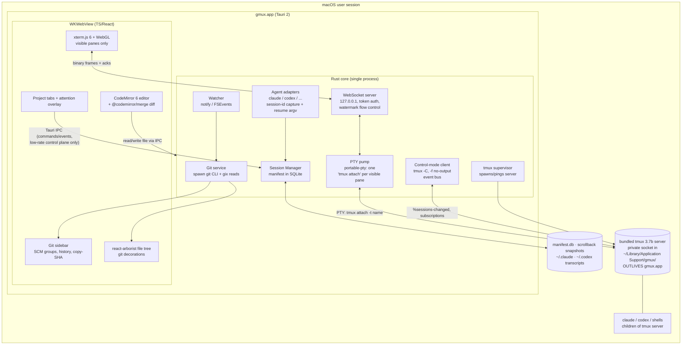

# Design C — gmux on Tauri v2 (Rust core + webview UI)

**Status:** candidate design, 2026-08-09
**One-sentence thesis:** A Tauri 2 app whose Rust core supervises a bundled, pinned tmux server as the session-durability daemon and pumps PTY bytes to xterm.js over a localhost WebSocket (bypassing Tauri IPC), with a GitButler-style Rust git service (git CLI + gix) and CodeMirror 6 rendering the IDE furniture in the WKWebView.

All claims below are grounded in the research docs in `../research/` (01–10, all verified against live sources on 2026-08-09) or cite primary URLs directly.

---

## 1. Why Tauri — the explicit native vs Electron vs Tauri weighing (P6)

The three stacks as of August 2026 (research 08):

| | Electron 43.3 | **Tauri 2.11.5** | Native Swift |
|---|---|---|---|
| Idle memory, single window | ~250–400 MB realistic with panels ([Hopp benchmark](https://www.gethopp.app/blog/tauri-vs-electron): 409 MB @ 6 windows; Wave measures 400–800 MB in daily use) | **~100–200 MB realistic** (Hopp: 172 MB @ 6 windows; ~30–40 MB idle baseline) | Best-in-class (Ghostty idles 24–45 MB) |
| Bundle size | ~244 MiB | **~8.6 MiB** | small |
| PTY→UI data path | node-pty + MessagePorts, VS Code-proven flow control | **Tauri IPC unfit for firehoses** — must own a WebSocket transport (§5) | in-process, no boundary |
| P2/P3/P4 components | Monaco/xterm.js/react-arborist, all free | **Same web ecosystem** (CodeMirror instead of Monaco) | Hand-build diff view, tree decorations, editor on pre-1.0 components (research 07: +3–6 wk) |
| Solo-dev + AI-agent velocity | One language (TS), agents strongest | **Two languages; agents write competent Rust but compile loop is slower** (Hopp: 80.9 s initial Rust build vs 15.8 s) | Agents documented weakest at Swift/SwiftUI; CodeEdit still pre-1.0 after 4+ years |
| Shipped precedent for this shape | VS Code (the panel set), Wave (detached daemon) | **GitButler** — polished, a16z-funded git desktop app on Tauri 2 + Rust; but *nobody* has shipped a many-PTY terminal on Tauri | Ghostty/cmux (terminal only, no IDE furniture) |

**The case for Design C:** gmux is the app the user keeps open all day next to real work — the ~150–250 MB it saves over Electron is a durable, daily win on a laptop, and the Rust core is genuinely the *right tool* for the system layer this design needs (process supervision, PTY plumbing, FSEvents, SQLite, git). Crucially, this design **deletes the hardest custom component the Electron design must build** — the bespoke session daemon — by delegating durability to tmux (§4), which shrinks Rust's job to "supervisor + byte pump + git service." The web half stays in agent-friendly TypeScript with the same MIT component ecosystem Electron would use.

**The honest costs** (weighed, not hidden): (a) Tauri's IPC measurably cannot carry PTY output streams — events can't carry ArrayBuffers and a 3 MB payload took ~200 ms in the wild ([tauri#13405](https://github.com/tauri-apps/tauri/issues/13405), [discussion #7146](https://github.com/tauri-apps/tauri/discussions/7146)) — so we own a localhost WebSocket transport with backpressure (§5); (b) WKWebView has terminal-hostile quirks that need a week-1 spike (§6); (c) two-language development is a real velocity tax for a solo dev working through agents. Section 12 prices these as risks.

Native Swift remains the plausible "gmux 2.0" endgame once libghostty's Swift framework stabilizes (research 08 §10), but for a solo v1, P2–P4 have no production-ready native components and the diff view alone is weeks of bespoke work (research 07).

---

## 2. Architecture



Two data planes, deliberately separated:

- **Control plane** (low rate): Tauri commands/events, typed end-to-end with [tauri-specta](https://github.com/specta-rs/tauri-specta) — session CRUD, git status payloads, file open/save, decorations, agent status. Tauri IPC is fine here.
- **Data plane** (firehose): PTY bytes over a localhost WebSocket, never through Tauri IPC (§5).

The **tmux server is the durability boundary**: it is spawned by gmux.app but daemonizes and outlives it. Everything left of the WebView dies with the app and is rebuilt from tmux + manifest on relaunch — by construction, nothing that must survive lives in the app process.

---

## 3. Exact OSS components and licenses

| Component | Role | License | Version / activity (verified 2026-08-09) |
|---|---|---|---|
| [Tauri](https://github.com/tauri-apps/tauri) 2.x (wry/tao) | App shell, WKWebView host, bundler/signing/updater | MIT OR Apache-2.0 | 2.11.5 (2026-07-01), healthy cadence (research 08) |
| [tmux](https://github.com/tmux/tmux) — **bundled, pinned** | Durability daemon: named sessions, PTY ownership, server-side scrollback, control-mode events | **ISC** (bundle-friendly) | 3.7b (2026-07-01), commits within days (research 01) |
| [portable-pty](https://crates.io/crates/portable-pty) | PTYs hosting `tmux attach` clients | MIT | 0.9.0, 10.7M downloads (research 05) |
| tokio + [tokio-tungstenite](https://crates.io/crates/tokio-tungstenite) | Async runtime + localhost WS transport | MIT | active |
| [gitoxide/gix](https://github.com/GitoxideLabs/gitoxide) | Hot read paths (status/log) — optional accelerator | MIT/Apache-2.0 | 0.56.0 (2026-07-23), very active (research 06) |
| system `git` CLI (spawned) | **All mutations** + baseline reads; inherits hooks/signing/credentials/fsmonitor | GPL-2.0 (unlinked — process boundary, no license coupling) | ships with Xcode CLT |
| [notify](https://crates.io/crates/notify) | FSEvents watching (worktree + dotgit watchers) | CC0-1.0 | active (research 06) |
| [rusqlite](https://crates.io/crates/rusqlite) | Session manifest + app state (GitButler-proven) | MIT | active |
| [xterm.js](https://github.com/xtermjs/xterm.js) 6 + @xterm/addon-webgl | Terminal rendering in webview | MIT | 6.0.0 (2025-12-22); beta train daily, 6.1.0-beta.300 on 2026-08-09 (research 05) |
| [CodeMirror 6](https://code.haverbeke.berlin/codemirror/dev/) + [@codemirror/merge](https://github.com/codemirror/merge) | Editor + side-by-side/unified diff | MIT | @codemirror/view 6.43.8 (2026-08-04); merge 6.12.2 (2026-06-09). Migrated GitHub→Forgejo Apr 2026 — active, not abandoned (research 07) |
| [react-arborist](https://github.com/jameskerr/react-arborist) | Virtualized file tree with custom decoration renderers | MIT | pushed 2026-07-25 (research 07) |
| React + Zustand | Webview UI framework/state | MIT | commodity |
| [tauri-specta](https://github.com/specta-rs/tauri-specta) | Typed Rust↔TS IPC bindings | MIT | active |
| [tauri-plugin-autostart](https://github.com/tauri-apps/plugins-workspace) | Launch-at-login for reboot restore | MIT/Apache-2.0 | maintained in plugins-workspace |
| [lazygit](https://github.com/jesseduffield/lazygit) | Power-git escape hatch in a persistent pane (full scope) | MIT | v0.64.0 (2026-08-04) (research 06) |

**Reference-only (not dependencies):** GitButler (FSL-1.1-MIT — *not* OSS for 2 years per release; architecture precedent only, §9); iTerm2's control-mode client (GPL-2.0 — read as spec); wmux/agent-deck (MIT — session-schema prior art); VS Code `extensions/git` (MIT — parser spec to port to Rust). **Avoided:** nodegit/objective-git (dormant), zellij as embed target (no control mode), wezterm-mux crates (unpublished, lockstep protocol, stalled stable releases), STTextView (GPLv3), claude-squad/coder-mux (AGPL).

Everything gmux links or bundles is MIT/Apache-2.0/ISC/CC0. The git CLI is invoked across a process boundary (no GPL coupling); libgit2 (GPLv2 + linking exception) is not needed at all since we prefer gix + CLI.

---

## 4. The durability layer decision: tmux control mode vs zellij vs own PTY host

This is the load-bearing choice for P1. Three candidates were evaluated end-to-end (research 01, 09):

### Chosen: bundled, pinned tmux on a private socket — "hybrid" integration

- **What it buys, completely and for free:** T1 survival (app quit/crash/update → server, PTYs, agent processes, full scrollback all untouched); named sessions as first-class server state (`tmux ls -F '#{session_name}'`); queryable server-side scrollback (`capture-pane -p -e -J -S -` returns full ANSI history for instant backfill); an event bus (control mode `-C`: `%sessions-changed`, `%session-renamed`, format subscriptions via `refresh-client -B` for `pane_current_command`/`pane_current_path` badges); per-session key/value storage on the server itself (user options `@gmux-*`) so the durable process is self-describing. ISC license permits bundling; 3.7b shipped 2026-07-01; iTerm2 has bet on this integration surface for a decade (research 01 §3).
- **Integration style — hybrid, not `-CC` (research 01 §3.2, 09 A.4):** each *visible* gmux pane is a real PTY (portable-pty) running plain `tmux attach -t <name>` against a config with status line off, prefix none, mouse off — tmux is invisible and xterm.js renders full-fidelity output. One background `-C` control client with `-f no-output` supplies events and metadata. This gets ~100% of the rendering fidelity for ~10% of the protocol work; the full `-CC` client (framing, octal-unescape byte stream, `%output` dispatch, `pause-after` flow control) is a documented Phase-2 upgrade if we ever want lazy attach without PTYs or remote hosts. iTerm2 is the existence proof; budgeting research 01's "weeks, not days" for `-CC` is exactly why it is *not* in the MVP.
- **Hygiene that prevents known failure classes:** private socket via `TMUX_TMPDIR=~/Library/Application Support/gmux/` (macOS /tmp cleanup makes default sockets unreachable after ~3 days — tmux(1) SIGUSR1 escape hatch documented; we sidestep the class, research 09 C.4); own `gmux-tmux.conf` (`exit-empty off`, `destroy-unattached off`, `history-limit 50000+`, status off); bundling a pinned binary kills control-protocol version skew — the #1 historical pain of tmux GUI clients — and never collides with the user's Homebrew tmux.

### Rejected: zellij

MIT, very active (v0.44.3, 2026-05-13), and its built-in 1-second KDL serialization is genuinely nice — but it is disqualified as an *embedded backend*: **no control mode / external rendering protocol exists** (open feature request [zellij#3965](https://github.com/zellij-org/zellij/issues/3965), no linked PRs as of Aug 2026), so a GUI drives it blind through its own TUI. Its resurrection also restores a *shell*, not the agent conversation (ps-sniffed commands, "press ENTER to run" banners, open reliability issues [#4129](https://github.com/zellij-org/zellij/issues/4129), [#4873](https://github.com/zellij-org/zellij/issues/4873)) — so it would not remove the need for gmux's own manifest anyway (research 01 §4, 09 B.3). cmux is attempting this path now; it is plausible but unproven, and strictly less introspectable than tmux formats.

### Rejected for v1, kept as plan B: own Rust PTY-host daemon

The wmux / Zed-RFC / VS Code-pty-host shape: a launchd-managed Rust daemon owns portable-pty PTYs, holds a headless grid per pane (alacritty_terminal or rio-vt), speaks a Unix-socket protocol to the app. It is the most "Tauri-native" design and would remove tmux's terminal-in-the-middle limitations (kitty protocol passthrough, etc.). But it rebuilds, from scratch and solo-maintained, what tmux has hardened for 20 years: daemon lifecycle, crash recovery, server-side scrollback with ANSI-preserving replay (alacritty_terminal has **no** serializer back to escape sequences — that's bespoke; rio-vt's embeddable API was ~2 weeks old at research time), flow control, and an event protocol. Research 05's cross-cutting verdict is blunt: durability = daemon-owned PTYs + buffer replica + serialize/replay + resume — and only the VS Code/xterm.js stack ships those pieces pre-built; in Rust every one is DIY. Estimated +3–4 weeks vs the tmux path *plus* owning the reliability tail forever. Revisit only if tmux's model becomes the ceiling (e.g., image-protocol passthrough demands).

---

## 5. PTY data plane: the WebSocket transport (Tauri's weak joint, engineered around)

**Problem (measured, not theoretical):** agent CLIs in "dump the whole diff" mode are fast producers; xterm.js absorbs 5–35 MB/s with a hard 50 MB input buffer ([flow-control guide](https://xtermjs.org/docs/guides/flowcontrol/)). Tauri events cannot carry ArrayBuffers and JSON-serialize through the webview message pipe (~200 ms for 3 MB) ([tauri#13405](https://github.com/tauri-apps/tauri/issues/13405), [#7146](https://github.com/tauri-apps/tauri/discussions/7146)). The community-standard fix — and this design's choice — is to bypass Tauri IPC for terminal bytes entirely (research 08 §4).

**Design:**

- Rust core binds a **tokio-tungstenite WS server on 127.0.0.1, ephemeral port**, single connection from the webview, authenticated by a 32-byte random token injected via webview initialization script at launch (never in the DOM/URL of remote content; localhost + token + Origin check).
- **One multiplexed connection**, binary frames: `[type:u8][pane_id:u32][payload]`. Down: PTY output chunks. Up: keystrokes, resize (`cols×rows`), and **acks**.
- **Watermark flow control per pane, exactly the xterm.js documented recipe:** client acks every ~128 KB it has *written into* xterm.js (via `term.write(data, callback)`); server suspends reading that pane's PTY when unacked bytes exceed ~512 KB and resumes at low water. Kernel PTY backpressure then stalls the `tmux attach` client — while the **tmux server keeps accepting agent output into its own history regardless**, so a slow UI never stalls or loses agent work. This is a materially better property than a raw-PTY design, where backpressure propagates to the agent itself.
- Hidden panes have **no PTY, no WS traffic, no xterm.js instance at all** — the session lives in tmux. Showing a pane = spawn `tmux attach`, backfill instantly with `capture-pane -p -e -J -S -50000`, then stream deltas. This is the biggest scalability lever of the whole design: 30 named sessions cost the webview nothing until viewed.
- Torture test in week 1 (acceptance-gated): `yes`, `cat 500MB.log`, and a Claude Code full-repo diff across 4 visible panes — UI stays responsive, memory bounded, zero corruption after settle.

---

## 6. WKWebView quirks: terminal rendering and IME (eyes open)

The prompt demands this be addressed head-on; these are the known landmines, each with a mitigation:

1. **60 fps `requestAnimationFrame` cap on macOS 13–15** — WKWebView caps rAF at 60 Hz regardless of ProMotion; lifted only in macOS 26 Tahoe ([tauri#11822](https://github.com/tauri-apps/tauri/issues/11822)). *Impact:* repaint rate, not throughput or correctness — xterm.js buffers writes independently of rAF and the WebGL renderer draws on ticks; 60 fps terminal repaint matches most shipping terminals. *Mitigation:* accept on ≤15; document ProMotion smoothness as a Tahoe+ nicety. Not a functional risk.
2. **WebGL context limits (~8–16 live contexts in WebKit)** — *Mitigation:* structural, already in §5 — only visible panes instantiate `@xterm/addon-webgl`; the addon survives context loss; DOM renderer is the automatic fallback (canvas renderer was removed in xterm.js 6). VS Code ships the same policy (research 05 §1).
3. **xterm.js dead-key input bug specific to WKWebView** ([xterm.js#5894](https://github.com/xtermjs/xterm.js/issues/5894), open) — hits international layouts (´, ~, ü composition). *Mitigation:* week-1 spike includes a keyboard/IME matrix (US, DE, ES dead keys; CJK IMEs; dictation); xterm.js is MIT and its textarea input path is patchable/vendorable if upstream lags; track the issue.
4. **IME generally** — xterm.js has mature composition-view IME support and 6.0.0 specifically fixed IME duplicate-input bugs (research 05 §1), but nearly all its IME mileage is Chromium. WKWebView's `NSTextInputClient` bridging differs. *Mitigation:* same spike; this is the single most likely source of "death by papercuts," which is why it is tested before any architecture is committed, not after.
5. **Scroll micro-jank reports in Tauri/WKWebView** ([tauri discussion #8436](https://github.com/tauri-apps/tauri/discussions/8436)) — *Mitigation:* gmux's shell is a fixed-viewport app (no page scrolling); terminal scrollback scrolls inside xterm.js's own viewport, and file tree/history lists are virtualized. The janky path is mostly avoided by construction.
6. **Editor workers** — Monaco's web-worker plumbing is the classic Tauri/WKWebView pain point ([monaco discussion #4486](https://github.com/microsoft/monaco-editor/discussions/4486)). *Mitigation:* we simply don't use Monaco — CodeMirror 6 needs no workers, weighs ~300 kB vs ~5 MB, and `@codemirror/merge` covers the diff-glance workflow (research 07 §1.2, §6). If diff polish ever demands Monaco, it can be lazy-loaded for diff views only.

**Kill-switch criterion:** if the week-1 spike shows unfixable IME/input breakage in WKWebView, the fallback is Design A's Electron shell with this same Rust logic compiled to a sidecar — the tmux/manifest/git architecture is shell-portable by design. That optionality is deliberate.

---

## 7. P1 — durable named sessions, full lifecycle (the killer feature, end-to-end)

Terminology from research 09: T1 = app quit/crash, T2 = tmux server death (rare), T3 = reboot. Names are the durable identity: **gmux session name == tmux session name == manifest primary key**, renames flow both ways (`%session-renamed` notification ↔ `tmux rename-session`).

### 7.1 Create

`gmux new "auth-refactor"` in project `webapp`, agent Claude Code:

1. Rust core writes the manifest row (SQLite) **before spawn**, pre-generating the Claude session UUID:

```jsonc
{
  "name": "auth-refactor",
  "project": "/Users/gdc/src/webapp",
  "cwd": "/Users/gdc/src/webapp",
  "argv": ["claude", "--session-id", "550e8400-...", "-n", "auth-refactor"],
  "env_delta": {},
  "agent": "claude-code",
  "agent_session_id": "550e8400-...",
  "resume_argv": ["claude", "--resume", "550e8400-..."],
  "window_layout": null,
  "status": "running", "created_at": "...", "last_seen": "..."
}
```

2. `tmux new-session -d -s auth-refactor -c ~/src/webapp 'claude --session-id 550e8400-... -n auth-refactor'`; mirror metadata into tmux user options (`set -t auth-refactor @gmux-agent claude-code ...`) so the server is self-describing even if the manifest is lost.
3. UI shows the pane: portable-pty spawns `tmux attach -t auth-refactor`, bytes stream over the WS to xterm.js.

**Per-agent session-ID capture** (research 02 matrix): Claude Code — **pre-assigned** via `--session-id <uuid>` (deterministic, nothing to parse; resume works from any cwd since v2.1.223); Codex CLI — no pre-assignment: `notify`-watch `~/.codex/sessions/YYYY/MM/DD/` for the rollout file created after spawn (filename embeds the UUID: `rollout-YYYY-MM-DDThh-mm-ss-<uuid>.jsonl[.zst]` — may be zstd-compressed and later moved to the sibling `archived_sessions` subdir, so the watcher matches both extensions and tolerates the move; [codex-rs `rollout/src/list.rs`](https://github.com/openai/codex/blob/main/codex-rs/rollout/src/list.rs)), fallback `codex resume --last` scoped to recorded cwd; cursor-agent — `cursor-agent create-chat` then launch with `--resume=<id>`; Amp — `amp threads new`; opencode — newest row in `opencode.db`; aider — no IDs, `--restore-chat-history` in recorded cwd; plain shells — argv+cwd only. **Record the full original argv**: Claude Code explicitly does not restore `--mcp-config`/`--add-dir`/`--settings` on resume — flags must be re-passed (research 02).

### 7.2 T1 — gmux quits, crashes, or updates → relaunch

- Agent processes, PTYs, scrollback, names: **all survive — they live in the tmux server, which never noticed.** The agent kept working while gmux was gone.
- Relaunch: ping/start server → `tmux ls -F ...` → reconcile against manifest (server is truth for liveness; manifest for metadata) → for each visible pane, `tmux attach` + instant scrollback backfill via `capture-pane -p -e -J -S -` (full ANSI history, colors intact).
- **Zero data loss, by construction.** UX label (VS Code's honest distinction, research 09 Part D): *"your sessions were never interrupted."*

### 7.3 T3 — machine reboot → login

Processes are gone by physics; conversations are not — every major agent persists transcripts to disk and resumes by replay (research 02).

1. **Login item** (tauri-plugin-autostart) starts gmux.app hidden. gmux.app itself spawns the tmux server as its child — deliberate, for TCC attribution (§7.5).
2. Reconcile: `tmux ls` empty → every manifest row with `status != exited` enters restore.
3. Per row: `tmux new-session -d -s <name> -c <cwd>`; re-split multi-pane sessions from the stored `#{window_layout}` string + `select-layout`; if a scrollback snapshot exists, launch the pane as `cat <snapshot>; exec $SHELL` so prior output is inert history above a fresh prompt (tmux-resurrect's proven trick — research 09 B.2).
4. **Arm the resume, don't fire it (default):** type `claude --resume 550e8400-...` / `codex resume <id>` into the pane *unexecuted*, with a "Resume" affordance in gmux chrome. Ten agents each re-reading a 150k-token transcript on login is real money and surprise; auto-resume is per-session opt-in, `:all:`-style danger mode explicit (research 02 §4, 09 B.4). Restore policies per session: *auto-resume* / *armed* (default) / *shell only*.
5. Scrollback snapshots: `capture-pane -e -J -S -` per pane on a slow timer + on `applicationWillTerminate` — the one inherently lossy-at-crash piece, same accepted loss window as VS Code revive.
6. UX label: *"restored: layout + conversation; process is a fresh resume; interactive shell env is gone."*

**Why this beats the plugin ecosystem:** tmux-resurrect (dormant since Aug 2024) and zellij serialization both *infer* commands from `ps` and can only replay static strings — neither can ever know the Claude session UUID. gmux is the launcher; it records ground truth and resumes the *specific conversation* (research 09 B.5 comparison table).

### 7.4 T2 — tmux server dies (rare) and sleep/wake

T2: processes and in-memory scrollback lost; recovery = the T3 manifest path minus the login trigger (control client's `%exit` detection surfaces the offer). This is exactly why the manifest is updated event-driven (on `%sessions-changed`/`%session-renamed`/create/close) rather than on a 15-minute timer. Sleep/wake: a non-event — processes and server survive; tolerate an output burst on wake (research 09 C.3).

### 7.5 macOS TCC (the gotcha that ships bugs in competitors)

launchd-spawned trees do **not** inherit any terminal's Full Disk Access; cmux ships this failure today (`ls ~/Documents` → "Operation not permitted", [cmux#2866](https://github.com/manaflow-ai/cmux/issues/2866)). Design consequences (research 09 C.2): gmux.app spawns the tmux server itself so the responsible process is gmux.app; one-time FDA grant with a first-run explainer; **first-run self-test** (stat a file in `~/Documents` from inside a gmux pane, walk the user through granting if denied, with fallback grant for the bundled tmux binary since the daemonized server can be attributed to the tmux binary itself); regression-test per macOS major.

### 7.6 Acceptance tests (P1 is only real if these pass — research 09)

1. `kill -9` gmux mid-agent-run; relaunch → same agent PID, full scrollback, name intact.
2. Quit gmux 30 min while agent works → relaunch shows everything produced while detached.
3. Reboot mid-conversation → session recreated in cwd, prior scrollback visible, armed `claude --resume <uuid>` reloads the full conversation.
4. Reboot with 12 sessions across 3 projects → all restored under correct tabs/cwds/resume-ids, < 5 s.
5. TCC: restored agent reads `~/Documents` after the one-time grant.
6. Server socket reachable after 7+ days uptime (private `TMUX_TMPDIR` proves out).
7. `tmux kill-server` → gmux detects via `%exit`, offers T2 restore.

---

## 8. P2–P5: how the rest of the bar is met

### P2 — Git GUI (VS Code-grade)

The decisive research-06 finding: VS Code's git UX is a **CLI-spawning wrapper**, not a library. gmux's Rust git service does the same — and for gmux's audience it is *safer*: agents run `git` in the same worktree, and going through the same CLI honors `index.lock` and hooks instead of holding library handles to the index.

- **Reads:** `git status --porcelain=v2 --branch -z` (one call = branch + upstream + ahead/behind + all file states), `git log --format=%H%x00%h%x00%an%x00%at%x00%s -z -n 200` (full SHA field one → copy-SHA is a clipboard write), `git for-each-ref`. All background reads run with `GIT_OPTIONAL_LOCKS=0` so gmux never contends with an agent's git commands. **gix (gitoxide)** is the drop-in accelerator for status/log on monster repos — the GitButler-proven git2+gix hybrid pattern, adopted CLI-first.
- **Writes:** `git add`/`git restore --staged`/`git commit -m` via spawned CLI — inherits the user's hooks, signing, and credential helpers (a library commit would silently skip hooks). `GIT_ASKPASS` bridged to a gmux dialog, VS Code's pattern.
- **UI:** exactly VS Code's four resource groups (Merge/Staged/Changes/Untracked), commit box, always-visible branch header per project tab with ahead/behind; history list with one-click copy-SHA. Total surface: ~6 git invocations + parsers ported from VS Code's MIT `git.ts`/`parseGitCommits` as spec (research 06 §5).
- **Refresh:** two `notify` watchers per repo — worktree (excluding `.git/`) and dotgit (`.git/HEAD` → instant branch flip; ignore `index.lock`) — throttled status, ~500 ms debounced decoration repaint, `git.statusLimit`-style huge-repo guard. One-click `core.fsmonitor=true` (git ≥ 2.37, FSEvents-backed) keeps status sub-100 ms while agents churn thousands of files — gmux gets it free by shelling to the same git.
- **Escape hatch (full scope):** a persistent **lazygit** pane per project — since gmux's core product *is* durable terminal panes, embedding the MIT single-binary TUI costs ~zero code and instantly exceeds VS Code SCM depth (line staging, interactive rebase, bisect). Command configurable (lazygit/gitu/gitui, all MIT).

### P3 — File explorer with git decorations

react-arborist (virtualized — fine for 100k files) with custom node renderers; the decoration layer is the same `status --porcelain=v2` map published by the Rust git service: path → (badge letter M/A/D/R/U, color), **propagated up parent folders**, VS Code's exact model (research 06 §1.3). Rebuilt on the throttled status events; no polling.

### P4 — Click-to-view/edit

CodeMirror 6: syntax for gmux's whole language set via first-party Lezer packs (TS/JS, Python, Rust, Go, Swift, Markdown, JSON, YAML, shell), search, multi-cursor; ~300 kB, no workers, no WKWebView landmines. **`@codemirror/merge`** gives side-by-side and unified diffs with per-chunk accept/revert — the dominant gmux gesture is "click the file the agent touched → see the diff → tweak → save," and this is the component that ships it (research 07). File I/O over Tauri IPC with an mtime-conflict check (agents edit files under you; on external change while dirty, offer a merge view — the same widget).

### P5 — Multi-project tabs in one window

Research 10's Layout C, verbatim: **project tabs as the spine, attention overlay as the nervous system.**

- One window; top-level tabs, one per project (repo checkout or worktree). Tab chrome: name (derived from git-root basename, never prompted), optional color, current branch, dirty-count roll-up, agent-status dot with needs-input numeral. Idempotent open (Zed's behavior): opening an open project focuses its tab.
- Inside a tab: left sidebar (branch header + SCM + decorated tree), center editor, right stack of named durable sessions with status dots, F2/double-click rename (rename propagates to tmux + manifest — name *is* the resume address).
- **Global attention overlay** (⌘J + 🔔 + Dock badge): all NEEDS_INPUT sessions across every project, Enter jumps to tab + session. This imports the one superpower of session-list tools (Conductor, `claude agents` view) without surrendering the spatial model that matches the user's Cursor-windows habit.
- **Status detection, layered** (research 10 §6): Claude Code `Notification`/`Stop` hooks and Codex `notify` config auto-injected (highest fidelity) → BEL/OSC-9 seen by our own emulator → OSC 133 prompt marks (xterm.js `registerOscHandler`) → content-hash silence heuristic as tie-breaker. Heuristics make any CLI agent work on day one; hooks upgrade fidelity. State machine per session: IDLE → WORKING → NEEDS_INPUT.
- Worktrees: **aware, not required** (v1 shows honest `⎇ worktree` badges; "new session in worktree…" shells to `git worktree add`; lifecycle automation deferred — that's Conductor's product and Vibe Kanban's cleanup-liability lesson).

---

## 9. GitButler as the architectural precedent

[GitButler](https://github.com/gitbutlerapp/gitbutler) (Tauri 2 + Svelte frontend, Rust backend, 21.5k★, a16z-funded, pushed the day of research) is the existence proof for this design's *shape*: a polished, commercial-grade, git-heavy macOS desktop app on exactly this stack. What Design C adopts from it: heavy domain logic lives in the Rust core with the webview as a thin renderer; **git2/gix hybrid** for repo access (we go CLI-first + gix, one notch more conservative, for hook fidelity); **rusqlite for app state**; thin, typed IPC commands rather than chatty streaming (our streaming goes around IPC entirely, §5). What it does *not* prove — stated honestly — is the many-PTY terminal workload: GitButler has no terminal firehose, so §5–§6 are the parts of this design that are genuinely first-of-kind on Tauri, and they are exactly what the week-1 spike de-risks. License note: FSL-1.1-MIT (Fair Source, not OSS; each release converts to MIT after 2 years) — **reference architecture only, no code vendored.**

---

## 10. MVP scope vs full scope

### MVP (clears P1–P6 at "daily-drivable")

- Single window, project tabs (add/remove/reorder/rename, per-tab color), idempotent open.
- tmux-backed named sessions: create/rename/kill; T1 reattach with instant `capture-pane` backfill; WS data plane with watermark flow control; visible-panes-only rendering.
- Manifest (SQLite) + T3 reboot restore, **armed-resume default**, for Claude Code (pre-assigned `--session-id`) and Codex CLI (rollout watch); plain shells restore cwd. Login item + first-run TCC self-test.
- Git sidebar: branch header + ahead/behind, four groups, stage/unstage/commit, 200-commit history with copy-SHA; decorated file tree; watcher-driven refresh.
- CodeMirror editor + merge-view diff on click; save with conflict check.
- Status dots via the heuristic layer (bell + OSC 133 + silence hash); per-tab roll-up badge.
- Signed, notarized DMG (Tauri bundler + notarytool).

**Explicitly out of MVP:** `-CC` native-pane rendering, attention overlay, agent hooks injection, lazygit pane, worktree create-flow, auto-resume policies, scrollback snapshot timer (quit-time snapshot only), updater, additional agents.

### Full scope (the complete bar + differentiators)

- Attention overlay + Dock badge; Claude/Codex hook auto-injection for deterministic NEEDS_INPUT; per-session resume policies incl. auto-resume; timed scrollback snapshots.
- Agent adapters: cursor-agent, Amp, opencode, aider (research 02 priority order); per-session SpecStory wrapping as opt-in insurance layer.
- lazygit escape-hatch pane (configurable); diff-from-history; branch switch/create; stash.
- Worktree-aware session creation + badges; multi-pane layouts within a session (`window_layout` restore).
- Updater (Tauri updater plugin), settings/themes, command palette, scrollback search.
- Phase-2 option, only if pulled: full `-CC` control-mode client (native lazy attach, remote-host tmux over SSH — the same architecture extends to devboxes for free).

---

## 11. Effort estimate (strong solo dev + AI agents, 2026 tooling)

Assumes the agent-leverage profile of research 08 §7: agents strongest on the TS half, competent on Rust with a slower loop; the Rust surface is deliberately small because tmux absorbs the daemon problem.

| Phase | Work | Estimate |
|---|---|---|
| 0. De-risk spike | xterm.js+WS+portable-pty+`tmux attach` torture test in WKWebView; IME/dead-key matrix; `claude --session-id` reuse/`/clear` edge-case test (research 02 open gap) | 1 wk — **go/no-go gate** |
| 1. Session core | tmux supervisor + conf, control-mode event client, WS transport + flow control, manifest CRUD, session UI, T1 reattach + backfill | 2–2.5 wk |
| 2. Git + tree | git service (CLI + parsers), notify watchers, SCM sidebar, decorated tree | 1–1.5 wk |
| 3. Editor + tabs | CodeMirror + merge view, file I/O, project-tab shell polish | 1 wk |
| 4. Reboot + ship | T3 restore (Claude/Codex adapters), login item, TCC self-test, signing/notarization | 1 wk |
| **MVP total** | | **5–7 wk** |
| Full scope | overlay + hooks, more agents, lazygit, worktrees, updater, snapshots, palette, polish, hardening across macOS majors | +6–8 wk |
| **Full total** | | **12–15 wk** |

Contingency honesty: the two-language boundary and WKWebView input tail are the likeliest overrun sources; the Electron fallback (§6 kill-switch) caps the downside of the former's worst case.

---

## 12. Top 5 risks and mitigations

| # | Risk | Likelihood / impact | Mitigation |
|---|---|---|---|
| 1 | **Tauri IPC unfit for PTY streams** — the design's central workaround (own WS transport + backpressure) is bespoke, and nobody has shipped a many-PTY terminal on Tauri | Certain (it's why §5 exists) / High | Don't fight it: WS from day one, xterm.js's *documented* watermark recipe, single multiplexed connection, token-auth localhost; tmux server keeps history when the UI is slow, so worst case is deferred rendering, never lost output; week-1 torture test is the gate |
| 2 | **WKWebView input/IME breakage** (dead-key bug [xterm.js#5894](https://github.com/xtermjs/xterm.js/issues/5894), untested CJK/dictation path, pre-Tahoe 60 fps rAF cap) | Medium / High for international users | Week-1 keyboard/IME matrix *before* committing; xterm.js is MIT/vendorable for input-path patches; rAF cap accepted (parity with most terminals, lifted on macOS 26); **kill-switch: port the Rust core to an Electron sidecar — the architecture is shell-portable by design** |
| 3 | **macOS TCC/FDA attribution** breaks agent file access in restored sessions (shipping today in cmux, [#2866](https://github.com/manaflow-ai/cmux/issues/2866); semantics changed across 11.4 and Tahoe) | Medium / High (silent, user-visible) | gmux.app spawns the tmux server (responsible-process attribution); one-time FDA with first-run self-test + guided grant; fallback grant for bundled tmux binary; regression test per macOS major |
| 4 | **tmux integration sharp edges**: control-mode client bugs (attach races — the class exists, cf. iTerm2 #11174), octal-unescape/subscription handling, terminal-in-the-middle dropping exotic sequences | Medium / Medium | Hybrid pattern keeps MVP protocol surface tiny (plain `attach` renders; `-C` is events-only, `-f no-output`); **bundled pinned binary eliminates version skew entirely**; ANSI-standard agent CLIs are tmux's proven daily workload (claude-squad, agent-deck, millions of agent-hours); integration tests around attach/detach/rename races |
| 5 | **Two-language solo velocity tax + scope creep** (every cross-boundary feature needs types/serde/capability plumbing; CodeEdit's 4-year pre-1.0 arc is the cautionary tale for over-scoping) | Medium / Medium | tauri-specta generates the TS bindings (one source of truth); Rust surface intentionally minimal because tmux owns durability; strict MVP cut (§10) with the worktree/orchestration rabbit hole explicitly deferred; agents own the TS half where they're strongest |

Watchlist (not top-5 but tracked): agent-resume edge cases (`--session-id` after `/clear`, Codex rollout-format drift [#21761](https://github.com/openai/codex/issues/21761) — record codex version per session); CodeMirror's Forgejo migration (active, but off-GitHub — pin versions); rio-vt/libghostty maturation (would upgrade the plan-B PTY host).

---

## 13. Summary judgment

Design C's bet is that **the best durability layer already exists** (tmux: ISC, 3.7b, iTerm2-proven as a GUI backend) and that Rust + Tauri is the lightest credible shell to wrap around it: ~100–200 MB where Electron runs 250–400+, an 8 MB bundle, a Rust core that treats sessions/git/watching as the systems problems they are, and 100% MIT/permissive components for the UI furniture. Its two genuine unknowns — the WS PTY transport and WKWebView input — are both front-loaded into a one-week gated spike with a designed Electron fallback. What it deliberately does *not* do is rebuild tmux in Rust, render via `-CC` in v1, or inherit anyone's AGPL/FSL codebase.
