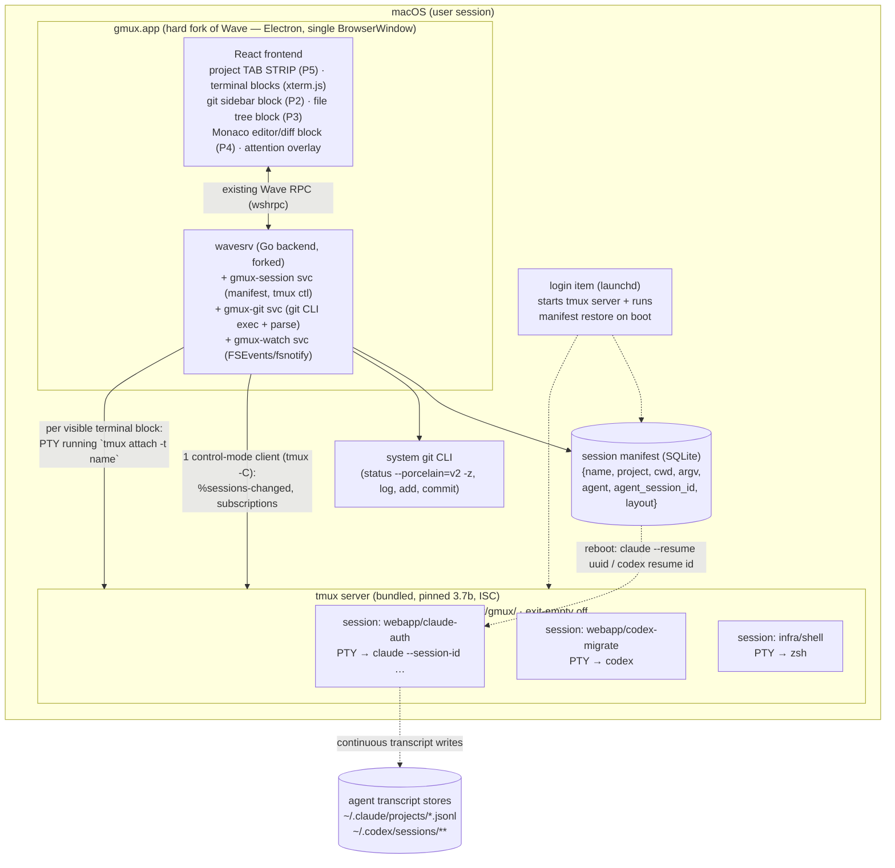

# Design D — Fork/Extend an Existing OSS Project

**Thesis:** Instead of building a new shell, hard-fork **Wave Terminal** (Apache-2.0, Electron + Go) — the only actively maintained OSS app whose product shape (persistent block/workspace model, Monaco editor + diff viewer, multi-project workspaces, detached Go backend) already covers roughly half the gmux bar — and close the gap with four deltas: (1) a bundled, pinned **tmux** underneath every terminal block for true P1 durability plus a gmux-owned session manifest for reboot resurrection, (2) a VS Code-grade **git sidebar block**, (3) a **git-decorated file tree block**, (4) converting Wave's modal workspace switcher into an always-visible **project tab strip**. Runner-up fork base: **Nimbalyst** (MIT). Explicitly rejected: forking VS Code/VSCodium, cmux, Tabby, WezTerm, and all AGPL/ELv2/FSL candidates.

**Date:** 2026-08-09. All claims grounded in `/docs/research/01–10` (verified against primary sources on this date) plus fresh web checks noted inline.

---

## 1. Candidate scan — who could even be forked

The bar: P1 durable named sessions (restart + reboot), P2 VS Code-grade SCM, P3 decorated file tree, P4 click-to-edit editor, P5 multi-project tabs in one window, P6 lightweight.

| Candidate | License | Alive (Aug 2026)? | Already has | Missing vs bar | Fork verdict |
|---|---|---|---|---|---|
| **Wave Terminal** | **Apache-2.0** | ✅ v0.14.5 Apr 2026, commits Jul 2026 | Persistent block/tab/layout store; workspaces (name/icon/color); **Monaco editor block + diff viewer** (since v0.12.2); detached Go backend (`wavesrv`); SSH Durable Sessions (v0.14) | **Local** terminal durability (docs explicitly exclude local; the old demand issue [#747] was closed as legacy/not-planned); git GUI; decorated tree; tab-strip navigation (one active workspace per window) | **PRIMARY** — deltas are additions to an extension-friendly block model, not amputations |
| **Nimbalyst** (Crystal successor) | MIT | ✅ 5.5k commits, active company | Monaco + Lexical editors, git ops (rebase/squash, AI commits), worktrees, multi-project, embedded terminal (ghostty-based), session resume | Durable *named terminal* model (P1 is agent-resume only, no PTY daemon); kanban/visual-doc center of gravity is ~60% of the codebase gmux doesn't want | **RUNNER-UP** — strip-down base; bigger amputation, company-driven roadmap |
| cmux | **GPL-3.0-or-later** | ✅ very active, 25.8k★ | P1 incl. reboot survival (proven UX), P5 vertical tabs, P6 native Swift + libghostty | P2/P3/P4 entirely (terminal-only by philosophy); GPL forces gmux to be GPL | Reject as base (license + the missing half is IDE furniture, which is weakest to build in Swift per research 08); keep as the P1 existence proof to imitate |
| VS Code / VSCodium fork | MIT | ✅ | P2, P3, P4 world-class; pty-host reconnect/revive machinery | **P5 refused upstream** (project tabs closed as duplicate, vscode#322745 — VS Code has no plan to ship them); P1 full-quit kills shells (pty host is an app child); forking the workbench = Cursor-scale merge treadmill against monthly releases | Reject as fork; see §2.1 for the "no new app" extension-glue variant |
| Tabby | MIT | ⚠️ 14-month release gap | Profile manager, tabs | No P1 daemon, no P2–P4, Angular-era Electron | Reject (momentum gone) |
| WezTerm (fork app or use mux-server) | MIT | ⚠️ nightlies only since Feb 2024, one spare-time maintainer | Real mux daemon (T1 reattach) | Bespoke wgpu GUI (no native/web widgets for P2–P4); private lockstep protocol | Reject (research 01/03) |
| Ghostty macOS app | MIT | ✅ | Best-in-class native terminal shell | Everything else (no P1 daemon, P2–P5); embedding API "not stabilized" | That's Design B/C territory (greenfield around libghostty), not a fork that shortcuts the bar |
| Crystal | MIT | ❌ deprecated Feb 2026 | — | — | Mine for plumbing only |
| claude-squad, coder/mux | **AGPL-3.0** | ✅ | — | — | License-reject (viral for a distributed app) |
| Superset | **ELv2 (source-available, not OSS)** | ✅ | — | — | License-reject; read, don't fork |
| Warp | AGPL core / MIT `warpui` | ✅ | — | — | License-reject core; UX reference only |
| GitButler | **FSL-1.1-MIT (Fair Source, not OSS)** | ✅ | — | — | License-reject; architecture reference |

(Sources: research 03 §scorecard, research 04 §2/§6; Wave #747 status and Monaco/diff confirmation re-verified via web on 2026-08-09.)

**Stack consequence (P6 framing):** forking means inheriting the upstream's stack. The only bar-adjacent candidates with fork-safe licenses are **Electron** apps (Wave Apache-2.0, Nimbalyst MIT). The one native candidate that nails P1 (cmux) is GPL and lacks P2–P4; Tauri has no candidate at all (GitButler is Fair Source). **So Design D is intrinsically an Electron design** — the native-vs-Electron-vs-Tauri tradeoff is weighed explicitly in §8.

### 2.1 The zero-build baseline: "no new app" (VSCodium + tmux + extension glue)

Worth stating honestly because the user can run it *this week*: VSCodium + integrated terminals running `tmux -L gmux attach -t <name>` gets P2/P3/P4 for free and P1-restart via tmux (T1 survives even a full app quit, because tmux — not the pty host — owns the processes). A small companion extension + shell script can implement the manifest/resume half of P1. **What it cannot deliver: P5.** Multi-root workspaces merge folders (one terminal panel, one settings blend); project-tabs-in-one-window was requested and closed as duplicate, with no plan to ship it (vscode#322745, research 10 §2.2) — the user keeps juggling cmd+` windows, which is the pain that motivated gmux. It also leaves named-session UX trapped in tmux keybindings rather than first-class UI. **Verdict: recommended as the week-one stopgap while the fork is built; not the design.**

---

## 2. Chosen design: gmux as a hard fork of Wave Terminal

### Why Wave over Nimbalyst

- **License & posture:** Apache-2.0, community-shaped infrastructure (blocks, workspaces, object store, RPC) vs Nimbalyst's MIT but company-driven, kanban-centric product. gmux's deltas to Wave are mostly *new block types and a nav change*; the deltas to Nimbalyst are *removing the center of the product* (kanban, visual docs, mobile companions) — amputation across 5.5k commits, with guaranteed violent divergence from an upstream actively building in the opposite direction.
- **The backend is the right shape:** `wavesrv` (Go) is a separate backend process with an RPC layer and a persistent object store for blocks/tabs/layout — the exact chassis needed to host git/status/watcher services and the tmux control-mode client. Wave already *designed* durable sessions (job manager owning shells via Unix sockets) — just shipped it SSH-only (research 03 §Wave; docs.waveterm.dev/durable-sessions).
- **P4 is already done:** Wave ships Monaco (the VS Code editor) as a block, including a Monaco **diff viewer** (added v0.12.2) — the single most expensive P4 feature per research 07 comes free.
- **Workspace = the right unit for P5:** named + icon + color + persisted tab set (research 10 §2.4); the delta is navigation (tab strip instead of modal switch), not data model.

### What gets deleted from the fork

AI chat panel and cloud/AI provider integration, web browser block, wsh remote-widget surface area we don't need, telemetry, auto-update channels pointing at Wave. Target: a leaner binary and a leaner attack surface. (This is also the footprint mitigation — Wave's 400–800 MB day-to-day reports (research 08 §2) are with the full block zoo loaded.)

### Architecture



Key property: **the GUI is disposable**. Quit, crash, or update gmux.app and every agent keeps running inside the tmux server; relaunch reattaches by name. The manifest + agent transcript stores make even a reboot recoverable.

---

## 3. Durability layer choice: tmux (bundled, pinned) — not zellij, not extending wavesrv

Per research 01 §10 and research 09, the three options and the call:

| | tmux (chosen) | zellij | Own PTY host (extend wavesrv job manager to local) |
|---|---|---|---|
| GUI-external event/render protocol | ✅ control mode (`-C`/`-CC`), formats, subscriptions — iTerm2-proven for a decade | ❌ none; open unassigned issue zellij#3965 | ✅ you own it (Wave's RPC) |
| T1 (app quit/crash) survival | ✅ by construction | ✅ | ✅ *if* promoted to a detached launchd daemon (today wavesrv dies with the app) |
| Server-side queryable scrollback | ✅ `capture-pane -e -J -S -` | ⚠️ opt-in serialization, not queryable live | Build it (headless buffer replica à la VS Code) |
| Reboot story | App-level manifest (better than tmux-resurrect, dormant since 2024) | Built-in serialization, but ps-sniffed commands — restores a *shell*, never `claude --resume <uuid>` | App-level manifest either way |
| Fork-diff size | **Small**: terminal blocks just run `tmux attach`; one Go control client | Medium, and driven blind (no protocol) | **Large**: re-architect wavesrv lifetime, buffer persistence, reconnect semantics |
| License / maintenance | ISC; 3.7b Jul 2026, commits this week | MIT; active | Apache-2.0 (ours) |

**Rationale:** tmux is the only layer that is simultaneously alive, liberally licensed (ISC — bundleable), battle-tested as a GUI backend (iTerm2 `-CC` for 10+ years), and scriptable enough for a product (formats + user options + control mode) — research 01's bottom line. Decisive for a *fork* specifically: the tmux route is the smallest possible diff against upstream Wave — terminal blocks keep using Wave's existing PTY/xterm.js path unchanged; the only new code is *what command the block runs* (`tmux attach -t <name>`) plus one control-mode client in Go. Extending Wave's job manager to local is the architecturally "purest" option and a potential upstream contribution later (Wave designed it for SSH; localhost is the same pattern), but it is a rearchitecture of wavesrv's process lifetime — weeks of risk the MVP doesn't need. zellij is disqualified for embedding by the missing control protocol (research 01 §4).

**Integration style (research 01 §3.2 "pragmatic hybrid", research 09 A.4 pattern 1):**
- Each visible terminal block = Wave's normal PTY running plain `tmux attach -t <name>` with tmux rendered invisible (`status off`, `prefix None`, mouse passthrough on) via gmux's own `gmux-tmux.conf`.
- One background `tmux -C attach -f no-output` client inside wavesrv = the event bus: `%sessions-changed`, `%session-renamed`, `%exit`, plus `refresh-client -B` subscriptions on `#{pane_current_command}`/`#{pane_current_path}` to drive status dots and cwd tracking without polling.
- Graduate to full `-CC` (native panes, `%output` streams, `pause-after` flow control) only if/when needed — Phase 2, not MVP.

**Operational hardening (research 09):** dedicated socket dir `TMUX_TMPDIR=~/Library/Application Support/gmux/` (macOS /tmp cleanup would otherwise orphan the socket); `exit-empty off`; `history-limit 50000`; bundle a **pinned** tmux binary inside gmux.app (ISC permits; kills control-protocol version skew and Homebrew drift; stable path for TCC grants); never touch the user's own tmux server or `~/.tmux.conf`.

---

## 4. P1 — Durable named sessions: the full lifecycle

The named session is gmux's primary object. Name = tmux session name = manifest key = display identity (rename via F2/double-click → `tmux rename-session` + manifest update; uniqueness by suffix, never rejection — research 10 §4).

### Manifest (SQLite in `~/Library/Application Support/gmux/manifest.db`, written by wavesrv)

```jsonc
{
  "name": "webapp/claude-auth",          // durable, user-visible; = tmux session name
  "project": "/Users/gdc/src/webapp",    // owning project tab
  "cwd": "/Users/gdc/src/webapp",        // refreshed via format subscription
  "argv": ["claude", "--session-id", "550e8400-…", "--mcp-config", "./mcp.json"],
  "env_delta": {},                        // only what gmux injected
  "agent": "claude-code",                 // null for plain shells
  "agent_session_id": "550e8400-…",       // the resume key
  "resume_argv": ["claude", "--resume", "550e8400-…", "--mcp-config", "./mcp.json"],
  "window_layout": "b25f,80x24,0,0,2",    // #{window_layout} snapshot
  "status": "running | exited | awaiting-restore",
  "created_at": "…", "last_seen": "…"
}
```

Recording the **full original argv and resume argv** is load-bearing: Claude Code documents that `--mcp-config`/`--add-dir`/`--settings` are *not* restored by `--resume` and must be re-passed (research 02). Snapshot cadence is event-driven (control-mode notifications on create/rename/close/layout-change), not a 15-minute timer — one of the two structural improvements over tmux-resurrect.

### Agent session-ID capture (research 02 matrix)

| Agent | Capture method | Resume command |
|---|---|---|
| Claude Code | **Pre-assign**: gmux generates UUID, launches `claude --session-id <uuid>` (belt-and-braces: `SessionStart` hook posts `session_id` to a local gmux socket) | `claude --resume <uuid>` (cross-cwd since v2.1.223; headless `-p --resume` available) |
| Codex CLI | Watch `~/.codex/sessions/YYYY/MM/DD/` via FSEvents for the rollout file created after spawn — `rollout-YYYY-MM-DDThh-mm-ss-<uuid>.jsonl[.zst]`; files may be zstd-compressed and later moved to the sibling `archived_sessions` subdir, so match both extensions and tolerate the move (codex-rs `rollout/src/list.rs`) | `codex resume <uuid>` (fallback: `codex resume --last` scoped to recorded cwd) |
| cursor-agent | **Pre-create**: `cursor-agent create-chat` → launch with `--resume=<id>` from the start | same `--resume=<id>` |
| Amp | `amp threads new` → record `T-…` id | `amp threads continue <id>` (needs network) |
| opencode | Read newest session from `opencode.db` (or local server API) after spawn | `opencode --session <id>` in recorded cwd |
| aider | none (one history per repo) | `aider --restore-chat-history` in recorded cwd |
| Plain shell | n/a | fresh shell in recorded cwd |

Session-ID-based resume is mandatory, not nice-to-have: multiple named terminals in the *same* repo is gmux's normal case, and cwd-scoped `--continue`/`resume --last` would resume the wrong conversation (research 02 §strategies).

### Lifecycle (normative, from research 09 Part E)

- **Create:** manifest row written (UUID pre-generated) → `tmux -L gmux new-session -d -s <name> -c <cwd>` → pane runs the agent argv → terminal block attaches; control client confirms.
- **gmux quits / crashes / updates (T1):** agent process, PTY, scrollback, names — all ✅ untouched (tmux server owns them; agents keep working while the GUI is gone). Relaunch: `tmux ls -F` → reconcile vs manifest → blocks re-run `tmux attach`; scrollback backfills instantly via server memory. **Zero loss, by construction.**
- **tmux server dies (T2, rare):** processes ❌, conversation ✅ (agents persist transcripts continuously). Control client sees `%exit` → gmux offers manifest restore (same path as T3).
- **Machine reboots (T3):** login item (launchd LaunchAgent registered from gmux.app) starts the tmux server and runs restore: for each manifest row — `new-session -d -s <name> -c <cwd>` → `select-layout` from snapshot → optional scrollback snapshot `cat`-ed as inert text above a fresh shell (tmux-resurrect's one good trick) → agent relaunched **via `resume_argv`**, honoring a per-session policy: **armed** (command pre-typed, one Enter — the safe default; ten agents auto-re-reading 150k-token transcripts is real money and surprise) / *auto-resume* / *shell-only*. Interactive shell env (exports, venvs) is honestly gone — same line VS Code draws; the UX labels "never interrupted" (T1) vs "restored" (T3) distinctly.
- **Sleep/wake:** non-event.

**Acceptance tests** (from research 09, adopted verbatim as the P1 definition of done): kill -9 gmux with agent running → same agent PID on relaunch; 30-min detached work visible after relaunch; reboot mid-conversation → session re-created in cwd, prior scrollback visible, `claude --resume <uuid>` armed and functional; 12 sessions across 3 projects restored to correct tabs in <5 s; TCC self-test passes; 7-day socket longevity; `tmux kill-server` detected and recovered.

---

## 5. P2 — Git sidebar (a new Wave block type)

Shell out to the system git CLI from wavesrv (Go `os/exec`) — the VS Code model, per research 06 (VS Code's SCM is `cp.spawn` + porcelain parsing, not libgit2; shelling inherits hooks/config/signing/credential helpers and coexists safely with agents running git in the same worktree).

- One call powers everything: `git status --porcelain=v2 --branch -z` → branch + upstream + ahead/behind (always-visible header) + all file states.
- Four resource groups exactly (Merge / Staged / Changes / Untracked); stage `git add -- <p>`; unstage `git restore --staged -- <p>`; commit `git commit -F <file>` (runs the user's hooks — libgit2 wouldn't).
- History: `git log --format=%H%x00%h%x00%an%x00%at%x00%s -z -n 200` → list rows with one-click **copy-SHA** (full SHA is field one).
- Click a file → Monaco **diff view** (already in Wave) fed by `git diff [--cached] -- <p>`.
- All background reads run with `GIT_OPTIONAL_LOCKS=0` so gmux never takes the index lock against an agent's git commands; offer one-click `core.fsmonitor=true` per repo (git ≥2.37, FSEvents-backed: 3.2 s → 0.15 s status on 50k files).
- Refresh: VS Code's exact recipe — working-tree watcher (excluding `.git/`) + dotgit watcher (`.git/HEAD` → instant branch flip; ignore `index.lock`), throttled status, ~500 ms debounced decoration repaint, `statusLimit` guard. Watchers live in Go (fsnotify/FSEvents), events flow over Wave's existing RPC.
- **Escape hatch:** an optional persistent "git power pane" running **lazygit** (MIT, v0.64.0 Aug 2026) in a durable tmux session — line-level staging, interactive rebase, stash, bisect for ~zero code (research 06 §3.2). Command configurable (lazygit/gitu/gitui, all MIT).

Port VS Code's `git.ts`/`GitStatusParser`/`parseGitCommits` logic (MIT, ~2–3k LOC of near-dependency-free TS) to Go as the spec — or run them near-verbatim in the Electron main process if faster to ship; research 06 blesses both.

## 6. P3 — File tree with git decorations (new block type)

Wave's current file widget is a *preview*, not a project tree — this is new UI: **react-arborist** (MIT, active Jul 2026; virtualized for huge repos, inline rename, keyboard nav) rendering a tree fed by wavesrv. Decorations are the same `porcelain=v2` map from P2: path → (badge letter M/A/D/R/U, ThemeColor), **propagated up parent folders**, VS Code's `decorationProvider.ts` semantics exactly (research 06 §1.3, research 07 §4). Click → opens the file in the Monaco block (P4). One data source, two consumers: the SCM groups and the tree decorations never disagree.

## 7. P4 — Editor: already shipped by the fork base

Wave embeds **Monaco** (the literal VS Code editor component — MIT, 0.56.0 Jul 2026) with worker setup done and a **diff viewer** already wired (v0.12.2 Wave AI diffs; verified 2026-08-09). Delta is wiring, not building: open-on-click from tree/SCM, save, dirty markers, and defaulting to diff view for files the SCM marks modified (the dominant gesture is "glance at what the agent changed" — research 07 framing). This is the strongest single argument for the Wave fork: on any native path this exact feature is a 3–6-week build (research 07 §6).

## 8. P5 — Project tabs in one window · P6 — Lightweight (native vs Electron vs Tauri)

**P5:** Wave's workspace is already the right unit (name, icon, color, persisted tab/layout set — research 10 §2.4); its navigation is wrong (one active workspace per window, modal switch). The fork changes navigation: an **always-visible tab strip** across the top, one tab = one project (= one repo checkout or worktree; worktree-aware, not worktree-required — research 10 §7). Tab chrome: name · branch · dirty-count rollup · agent-status dot with needs-input numeral. Idempotent open (Zed's behavior): opening an open project focuses its tab. Plus the **attention overlay** (⌘J / 🔔 / Dock badge): all NEEDS_INPUT sessions across projects, Enter jumps to tab + session — Layout C from research 10 §8–9. Status detection is the layered stack of research 10 §6: Claude Code `Notification`/`Stop` hooks and Codex `notify` (auto-injected configs) > terminal bell/OSC 9 > OSC 133 prompt marks > content-hash silence heuristic, so unknown agents still work day one.

**P6 — the explicit stack weighing (research 08):**

- **Native Swift/AppKit:** best footprint (Ghostty idles 24–45 MB) and cleanest PTY path, but zero reusable native components at VS Code quality for P2/P3/P4 (a 3–6-week diff-view/tree build on pre-1.0 foundations), agents are demonstrably weakest at Swift/SwiftUI, and the only native fork candidate (cmux) is GPL *and* terminal-only. CodeEdit — a whole community — is still pre-1.0 on this scope. Scored 43/60 in research 08's matrix.
- **Tauri:** ~100–200 MB realistic and MIT — but there is **no Tauri fork candidate** (GitButler is Fair Source), Tauri IPC measurably can't carry many PTY firehoses without a hand-rolled WebSocket transport, and WKWebView has terminal-hostile quirks (60 fps rAF cap pre-Tahoe, xterm.js dead-key bug). 49/60. Choosing Tauri means greenfield — that's Design B/C's territory, not D's.
- **Electron:** 54/60 in research 08 — the pty/persistence blueprint (VS Code), the strongest AI-agent development velocity (one TS codebase + Go, both agent-strong), and *both* viable fork bases. Cost: ~250–400 MB realistic single-window baseline.

**Honest P6 accounting for this design:** a forked Wave will not be Ghostty-light. Mitigations: single `BrowserWindow` paid once (tabs are DOM); delete the AI/web/preview block zoo; only visible terminals get WebGL renderers (xterm.js context discipline, the VS Code pattern); perf budget in CI (<400 MB with 10 live sessions, <150 MB of that renderer-side). The honest comparison point is not Ghostty — it's the 3–6 full Cursor windows (each an Electron app + extension host + language servers) this replaces. Net RAM goes *down* for this user. If a truly native gmux matters later, that is the libghostty-Swift "gmux 2.0" path research 08 defers to 2027 — and the tmux + manifest durability layer built here carries over unchanged, because it lives outside the app.

---

## 9. Exact OSS components and licenses

| Component | Role | License | Status (verified) |
|---|---|---|---|
| **Wave Terminal** (`wavetermdev/waveterm`) | Fork base: Electron shell, React frontend, block/layout/object store, wavesrv Go backend, wshrpc | **Apache-2.0** | v0.14.5 Apr 16 2026; commits Jul 2026 |
| **tmux** (bundled, pinned 3.7b + libevent) | Durability layer: named sessions, PTY ownership, scrollback, control mode | **ISC** | 3.7b Jul 1 2026; commits week of 2026-08-07 |
| **xterm.js 6** (in Wave) | Terminal rendering (WebGL addon) | MIT | 6.0.0 Dec 2025; daily betas |
| **Monaco Editor** (in Wave) | P4 editor + diff viewer | MIT | 0.56.0 Jul 2026 |
| **react-arborist** | P3 virtualized file tree | MIT | pushed Jul 2026 |
| system **git** CLI | All P2/P3 data (spawned, never linked) | GPLv2 (exec'd as a separate process — no copyleft implication) | ships with Xcode CLT |
| VS Code `extensions/git` parsers | Ported spec/code for status/log/refs parsing + decoration model | MIT | continuous |
| **lazygit** (optional embedded pane) | Git power features | MIT | v0.64.0 Aug 4 2026 |
| fsnotify (Go) / FSEvents | Watchers in wavesrv | BSD-3 | active |
| Electron + electron-builder/updater | Shell, signing/notarization/updates | MIT | Electron 43.x Aug 2026 |
| SQLite (via Go driver) | Session manifest | Public domain / MIT drivers | — |
| Claude Code / Codex CLI / cursor-agent / Amp / opencode / aider | The agents (invoked, not shipped) | Proprietary / Apache-2.0 / proprietary / proprietary / MIT / Apache-2.0 | per research 02 |

**Deliberately absent:** tmux-resurrect/continuum (dormant since 2024; manifest supersedes), zellij (no control protocol), nodegit/objective-git/SwiftGit2 (dead or thin), anything AGPL (claude-squad, coder/mux, Warp core), ELv2 (Superset), FSL (GitButler), GPL bases (cmux, iTerm2, kitty).

---

## 10. Fork mechanics — and the honest maintenance-burden accounting

**Mode: hard fork, not tracking fork.** Fork at the v0.14.x tag, rename bundle ID/branding/update feed, delete unwanted surface, build the four deltas in *new* packages (`pkg/gmuxsession`, `pkg/gmuxgit`, frontend `app/block/gitpanel`, `app/block/filetree`, `app/tabstrip`). Do **not** attempt to rebase Wave's ongoing product development (their roadmap: AI features, remote workflows — mostly orthogonal or deleted surface for gmux). Cherry-pick upstream selectively: security fixes, Electron/xterm.js/Monaco bumps, terminal-block fixes.

Honest costs, both directions:

- **Fork vs greenfield — what forking buys:** a working Electron shell with signing/updates/packaging, a proven block/layout persistence store (Wave's whole "your layout survives restart" layer is exactly gmux's T1-UI problem, already solved), Monaco + diff wired, terminal blocks wired to a Go backend, and an RPC layer. Realistically **6–10 weeks of solo shell-plumbing avoided** vs greenfield Electron (Design A/B equivalents rebuild all of it).
- **What forking costs:** (1) ~1–2 weeks up-front comprehension of a large two-language codebase before the first productive delta; (2) permanent ownership of inherited surface — Wave's bugs in blocks we keep become ours; (3) divergence tax — every cherry-picked upstream bump risks conflicts in the tab-strip and block-registry areas we modified (budget ~2–4 days/quarter if we stay disciplined about isolating gmux code; unbounded if we don't); (4) no help from upstream for our use case — Wave closed the local-durability request as legacy/not-planned, so P1-local is philosophically *ours*, forever. (Silver lining: extending the job manager to localhost is a plausible upstream PR later, which would shrink the diff.)
- **The category warning (research 04 §7):** five gmux-adjacent projects died or stalled within ~12 months (Terragon, Vibe Kanban, Crystal, old-HumanLayer, VibeTunnel). The hard-fork posture is the mitigation — we depend on Wave's *code as of a tag* (can't rot retroactively), not on Wave's continued health. The load-bearing living dependencies are boring and diversified: tmux, git, Electron, Monaco, xterm.js.
- **Kill criterion:** if the week-1 spike (risk R2 below) shows the tab-strip or tmux-block deltas fighting Wave's layout engine rather than extending it, stop and fall back to greenfield Electron (research 08's recommended shape) reusing everything designed here — manifest, git service, tmux layer are all app-independent by construction.

---

## 11. MVP vs full scope

**MVP (the bar, minimally):**
- Fork, strip, rebrand; single window; project tab strip (P5, no attention overlay yet).
- P1 complete: bundled pinned tmux on private socket; terminal blocks = `tmux attach`; control-mode event client; manifest (create/rename/close/layout events); Claude Code `--session-id` pre-assign + Codex rollout watch; login-item restore with **armed** resume; T1/T3 acceptance tests 1–4 passing.
- P2: branch header, four groups, stage/unstage/commit, log-200 with copy-SHA, Monaco diff-on-click.
- P3: react-arborist tree + decorations with parent propagation.
- P4: open/edit/save from tree + SCM (Monaco already present).
- Signing/notarization/auto-update under gmux identity; TCC first-run FDA self-test.

**Full scope (adds):**
- Attention overlay + Dock badge + full layered status detection (hooks auto-injection for Claude/Codex, bell/OSC 133/silence heuristic); per-tab status rollups.
- Remaining agents (cursor-agent, Amp, opencode, aider) resume adapters; per-session restore policy UI; scrollback snapshots for T3 (`capture-pane -e -J -S -` on timer + quit).
- lazygit power pane; `core.fsmonitor` one-click; statusLimit guard; ahead/behind push/pull.
- Worktree-aware session creation ("new session in worktree…"); optional SpecStory wrapping per terminal.
- Perf pass to budget (<400 MB @ 10 sessions); multi-window support for multi-monitor.
- Phase-2 evaluation: `-CC` full control-mode rendering; upstreamable local job-manager as tmux alternative.

---

## 12. Effort estimate (strong solo dev + AI agents doing most typing)

TS + Go are both agent-strong stacks (research 08 §7); Wave's size is the main drag.

| Workstream | Estimate |
|---|---|
| Spike: fork builds/signs; prove tab strip + `tmux attach` block + one RPC round-trip | 1 wk (go/no-go gate) |
| Strip + rebrand + update feed | 0.5–1 wk |
| P1: tmux bundle/config, control client, manifest, Claude/Codex ID capture, login-item restore, acceptance tests | 2–2.5 wk |
| P5 tab strip + per-tab scoping | 1 wk |
| P2 git block (status/stage/commit/log/copy-SHA/diff wiring) | 1–1.5 wk |
| P3 tree + decorations | 1 wk |
| P4 wiring (open/save/diff default) | 0.5 wk |
| Packaging, TCC self-test, polish, dogfood fixes | 1 wk |
| **MVP total** | **≈ 6–8 wk** |
| Full scope (overlay, status stack, remaining agents, lazygit, snapshots, perf budget) | +5–7 wk |
| **Full total** | **≈ 12–15 wk** |

(Greenfield Electron comparison from research 08's blueprint: MVP ≈ 9–12 wk — the fork saves roughly a third, at the divergence costs of §10.)

---

## 13. Top 5 risks & mitigations

1. **The fork fights Wave's layout/block engine** (tab strip and always-on sidebars aren't how Wave composes UI; "extend" degrades into "rewrite inside someone else's app"). → *Mitigation:* the week-1 spike is a hard gate with defined pass criteria (tab strip renders per-workspace state; a block runs `tmux attach` cleanly; git RPC round-trip). Fail → fall back to greenfield Electron; the durability/git/manifest designs transfer intact.
2. **Upstream divergence tax / inherited-surface ownership** (Wave moves fast in directions we deleted; cherry-picks conflict; their bugs become ours). → *Mitigation:* hard-fork posture (§10); gmux code isolated in new packages/blocks; subscribe only to security + dependency bumps; quarterly, time-boxed sync budget; treat upstream as parts supplier, not platform.
3. **macOS TCC/FDA attribution breaks agent file access in restored sessions** — shipping today in a competitor (cmux#2866: `~/Documents` "Operation not permitted" on Tahoe); launchd-started trees don't inherit terminal grants (research 09 C.2). → *Mitigation:* gmux.app itself spawns the tmux server (login item registered from the app bundle, not a bare plist); bundled tmux at a stable path; first-run FDA self-test with guided grant (fallback: grant to bundled tmux binary); regression test per macOS major.
4. **Electron/Wave footprint undermines "lightweight" (P6)** — Wave measured 400–800 MB in the wild. → *Mitigation:* delete AI/web block zoo; single window; WebGL renderers only for visible terminals; scrollback lives in tmux (not the DOM); CI perf budget (<400 MB @ 10 sessions) with regression alerts; positioning honesty: the benchmark is N Cursor windows, and if a native rewrite is ever justified, the out-of-process durability layer carries over.
5. **tmux-in-the-middle fidelity + agent-resume edge cases** — tmux re-emits what it models (kitty-protocol extras dropped; `allow-passthrough` needed for some sequences); Claude `--session-id` reuse after `/clear`, Codex rollout-format drift on old sessions, opencode cwd bugs (research 01 §3.2, research 02 gaps). → *Mitigation:* pinned bundled tmux (one version to test; `extended-keys on`, `allow-passthrough on` in gmux conf) — millions of agent-hours already run inside tmux, and ANSI-standard agent CLIs are the happy path; hands-on test matrix for each agent's resume flags before enabling auto-resume; **armed** (pre-typed) restore as default so a bad resume costs one glance, not a wrong 150k-token replay; record agent CLI version per manifest row.

---

## 14. Sources

Research docs: `/Users/gdc/gmux/docs/research/01-durability-layer.md` … `10-multi-project-ux.md` (all verified 2026-08-09). Fresh checks this doc: Wave issue #747 status (closed as legacy/not-planned) — github.com/wavetermdev/waveterm/issues/747; Wave Monaco editor + diff viewer — deepwiki.com/wavetermdev/waveterm/4.2-file-operations, docs.waveterm.dev/releasenotes; Nimbalyst state (MIT, Electron+React+Monaco, ghostty-based terminal, kanban-centric) — github.com/nimbalyst/nimbalyst. Key primary sources inherited from research: tmux releases/wiki (Control Mode), docs.waveterm.dev/durable-sessions, code.claude.com/docs/en/cli-reference & /sessions, learn.chatgpt.com/docs/developer-commands?surface=cli (Codex CLI reference — formerly developers.openai.com/codex/cli/reference, which now 308-redirects there; content re-verified 2026-08-09), github.com/microsoft/vscode `extensions/git`, code.visualstudio.com/docs/terminal/advanced, github.com/manaflow-ai/cmux/issues/2866, github.com/jesseduffield/lazygit/releases.
