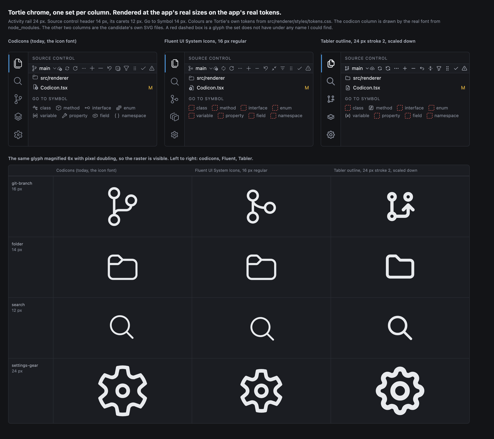

# Research 61, is there an icon set that gives Tortie more spunk than codicons

Author: research round for the operator, written 2026-08-21 against the worktree at
`scratchpad/wt-r61` and the installed packages under `/Users/gdc/gmux/node_modules`.
No file under `src` was changed, no dependency was added, and no git command that writes was run.

---

## 0. The answer

**KEEP CODICONS.** Nothing released in 2026 beats the incumbent for this product, and the reason is
not taste, it is coverage. The chrome does not draw 38 glyphs, it draws **96 distinct codicon ids
resolving to 95 distinct glyphs**, and 13 of those are the language symbol kinds the Go to Symbol
palette uses to tell a class from an enum member. I counted the published name list of every
candidate that survives licence and maintenance screening. **None of them carries a language symbol
vocabulary.** Fluent UI System Icons, which is the strongest challenger and was released on the day
I wrote this, is missing 15 of the 96. Tabler is missing 12. Both misses are almost entirely the
same wall. A change would therefore mean commissioning 13 new glyphs, which `CLAUDE.md` refuses
under "assemble, never reimplement", and drawing them in a second style, which `DESIGN.md` line 264
refuses under "no emoji, no mixed sets". The picture in section 1 shows the two candidates in
Tortie's own chrome at Tortie's own sizes, and the honest reading of it is that Fluent is a small
and pleasant difference rather than spunk, while Tabler reads 28 percent heavier at 16 px and
changes the weight of every dense list. He asked to be beaten by something newer and nothing beat
it. The one thing this round did find worth acting on is unrelated to the choice of set, and it is
in section 9. The CC BY 4.0 credit that four places in the tree promise is not actually in the About
panel. That stays true whatever set he picks, because Monaco ships its own copy of the codicon font
regardless.

---

## 1. The picture



`docs/research/assets/61-chrome-compare.png`, 2440 by 2170 device pixels, rendered at device pixel
ratio 2 in Google Chrome 151.0.7922.170 headless.

What is real in it and what is not:

- The colours are Tortie's own tokens, read from `src/renderer/styles/tokens.css`, being
  `--bg-canvas`, `--bg-sidebar`, `--bg-surface`, `--border`, `--text-primary`, `--text-secondary`,
  `--text-muted`, `--accent` and `--git-modified`.
- The sizes are Tortie's own. The activity rail is 24 px, because `src/renderer/app/ActivityBar.tsx`
  passes `size={24}`. The source control header is 14 px with 12 px carets, because
  `src/renderer/scm/BranchHeader.tsx` and `src/renderer/scm/ScmSection.tsx` pass `size={14}` and
  `size={12}`. The row height is 24 px, from `.scm-row` in `src/renderer/scm/scm.css`.
- The codicon column is drawn by the real font, being `codicon.ttf` copied out of
  `node_modules/@vscode/codicons/dist/`, through the real `codicon.css`. The other two columns are
  the candidates' own SVG files out of their npm tarballs, untouched except for the width and height
  attributes.
- A red dashed box is a glyph the set does not have under any name I could find. Every red box in
  the picture is in the Go to Symbol row.
- It is a mock of the chrome, not a screenshot of the running app. I did not build or launch Tortie.

The bottom half magnifies four glyphs 6 times with pixel doubling, so the raster is visible at the
sizes the app actually uses.

---

## 2. What this tree actually uses, counted this session

I parsed every `<Codicon …>` tag with a brace balanced walker, because 30 of the sites pass
`name={…}` with braces inside the tag and a plain regular expression gets them wrong. Then I
resolved every expression to its defining symbol, then checked all 96 resulting ids against the
`.codicon-*:before` rules in the installed `@vscode/codicons@0.0.46-24`.

| Quantity | Measured |
|---|---|
| `<Codicon>` render sites | 152 |
| Files that render one | 56 |
| Files with at least one literal `name="…"` | 49 |
| Files with at least one `name={…}` | 24 |
| Files with both | 17 |
| Distinct literal names | 38 |
| Literal name instances | 122 |
| Expression name sites | 30 |
| **Distinct ids that reach `Codicon`** | **96** |
| Distinct glyphs behind them | 95 |
| Ids that are not real codicon classes | 0 |
| Sites carrying a literal `className` | 15, over 14 distinct classes |

The charter's 38 is the literal count and it is right. It is not the migration surface. The other
58 ids arrive through maps and helper functions.

| Where the other 58 come from | File and symbol |
|---|---|
| Language symbol kinds | `src/renderer/search/symbol-kinds.ts`, `ICONS` and `symbolIcon` |
| Context categories and scopes | `src/renderer/context/groups.ts`, `CONTEXT_CATEGORY_ICON` and `SCOPE_CHIP_ICON` |
| Context row marks | `src/renderer/context/ContextRow.tsx`, `marksFor` |
| Run states | `src/renderer/scm/runs-format.ts`, `runGlyph` and `GLYPH_MUTED` |
| Ref badges | `src/renderer/scm/ref-badges.tsx`, `GLYPH` |
| Toasts | `src/renderer/app/Toasts.tsx`, `ICONS` |
| The settings rail | `src/renderer/settings/SettingsApp.tsx`, `SECTIONS` and `RailIcon` |
| Editor actions | `src/renderer/editor/EditorPanel.tsx` |
| Home screen actions | `src/renderer/app/HomeScreen.tsx` |
| Activity bar buttons | `src/renderer/app/ActivityBar.tsx`, the `icon="…"` props |
| Search query toggles | `src/renderer/search/QueryBlock.tsx` and `src/renderer/search/ResultsList.tsx` |
| Filter fields | `src/renderer/controls/FilterField.tsx`, the `icon` prop, default `search` |
| Position buttons | `src/renderer/app/projects-position.ts` and `src/renderer/app/sessions-position.ts` |

The full list of 96, in order:

```
account add arrow-both bell book case-sensitive check chevron-down chevron-left chevron-right
circle-large-outline circle-slash circuit-board clear-all clock close cloud cloud-download
cloud-upload code collapse-all copy dash debug-step-over discard ellipsis error exclude eye
file-media files filter fold-down fold-up folder folder-opened git-branch git-commit git-compare
globe gripper history hubot info keyboard layers layout-menubar layout-sidebar-left
layout-sidebar-right lightbulb loading lock map new-file new-folder open-preview output package
pass pass-filled plug refresh regex remove repo-clone rocket root-folder screen-full screen-normal
search search-stop settings-gear source-control split-horizontal symbol-class symbol-color
symbol-constant symbol-enum symbol-enum-member symbol-event symbol-field symbol-interface
symbol-keyword symbol-method symbol-misc symbol-namespace symbol-property symbol-structure
symbol-variable sync tag three-bars unverified vm warning whole-word
```

Two facts about that list:

1. `clock` and `history` are the same glyph, both at codepoint `ea82`. A timed out run in
   `runGlyph` and the history mark in `marksFor` draw the identical shape today.
2. 96 ids out of 746 class names in `codicon.css` is 12.9 percent of the set. The font carries 631
   glyphs at 639 codepoints and the app uses 95 of them.

The sizes the app asks for, over the 152 sites:

| Size in px | Sites |
|---|---|
| 14 | 60 |
| 12 | 47 |
| 16, explicit | 37 |
| 24 | 3 |
| 16, by default with no `size` prop | 2 |
| 18 | 1 |
| 11 | 1 |
| 10 | 1 |

**113 of 152, which is 74.3 percent, are not at 16 px, and 107 of 152, which is 70.4 percent, are
below it.** The two sites with no `size` prop are both in `src/renderer/app/RemoteDirPicker.tsx`.

---

## 3. Every candidate, with the deciding reason

Licence, version and release date in this table were fetched from `registry.npmjs.org` by me on
2026-08-21. Glyph counts marked "counted" I counted myself, either from the extracted tarball or
from the `unpkg.com/<pkg>/?meta` file listing. "Font in the npm package" means I walked the package
file list looking for `.ttf`, `.woff` or `.woff2`.

| Set, npm package | Licence | Latest | Native grid | Glyphs, counted | Font in the npm package | Deciding reason |
|---|---|---|---|---|---|---|
| **Codicons, `@vscode/codicons` 0.0.46-24** | CC-BY-4.0 | 2026-07-23 | 16 px, with 84 of its 702 sprite symbols off it | 746 class names, 639 codepoints, 631 glyphs in the TTF | Yes, TTF only, 149,508 bytes | **KEEP.** The only set in the field with a language symbol vocabulary, and it already fits |
| Fluent UI System Icons, `@fluentui/svg-icons` 1.1.338 | MIT | 2026-08-21 | 12, 16, 20, 24, 28, 32, 48 | 20,679 SVG files, of which 1,701 at 16 px regular | No | **Best challenger, still rejected.** 15 of the 96 missing, being all 13 language symbol kinds plus `search-stop` and `whole-word` |
| Tabler, `@tabler/icons` 3.46.0 | MIT | 2026-07-28 | 24 px, stroke 2 | 5,130 outline and 1,054 filled | No, the font is a separate package | 12 of the 96 missing, 11 of them symbol kinds. Reads 28 percent heavier at 16 px, measured in section 6 |
| Tabler webfont, `@tabler/icons-webfont` 3.46.0 | npm `license` field absent | 2026-07-28 | 24 px | same art | Yes, TTF 2,834,800 bytes | Same coverage failure, and its npm metadata declares no licence at all |
| Bootstrap Icons, `bootstrap-icons` 1.13.1 | MIT | 2025-05-09 | 16 px | 2,078 | Yes, woff2 134,044 bytes | 15 months without a release, and no symbol vocabulary |
| Octicons, `@primer/octicons` 19.33.0 | MIT | 2026-08-04 | 16 px and 24 px | 381 at 16 px, 351 at 24 px | No | Smallest field of any live candidate, no font, no symbol vocabulary. GitHub's own look, which is not spunk for a coding tool |
| Remix Icon, `remixicon` 4.9.1 | Apache-2.0 | 2026-01-29 | 24 px, filled | 3,229 | Yes, TTF 613,136 and woff2 189,216 | Filled 24 px art closes up at 12 px, which is 47 of the 152 sites. No symbol vocabulary |
| Carbon, `@carbon/icons` 11.86.0 | Apache-2.0 | 2026-08-12 | 32 px | 2,725 at 32, 68 at 16, 9 at 20, 8 at 24 | No | It is a 32 px set with 68 icons redrawn small. Tortie needs 96 |
| Iconoir, `iconoir` 7.12.1 | MIT | 2026-08-12 | 24 px, stroke 1.5 | 1,383 regular | No | A 1.5 stroke on a 24 grid lands at 0.75 px when drawn at 12 px. No symbol vocabulary |
| Material Symbols, `material-symbols` 0.46.0 | Apache-2.0 | 2026-08-14 | 24 px variable font | 3 style woff2 files, 3,960,036 bytes for outlined | Yes, woff2 | Reads as Android system UI. No symbol vocabulary |
| Hugeicons free, `@hugeicons/core-free-icons` 4.3.0 | MIT | 2026-08-20 | 24 px | not counted | No | Free and paid split inside one family, so a per glyph licence question at build time |
| Gravity UI, `@gravity-ui/icons` 2.21.0 | MIT | 2026-07-23 | not stated by the authors | 799 | No | 799 glyphs against a 96 id vocabulary is a thin margin, and the grid is undocumented |
| Ionicons, `ionicons` 8.1.0 | MIT | 2026-07-28 | 24 px | 1,357 | No | Drawn for phone chrome, at phone sizes. Wrong register for a 22 px list row |
| Mynaui, `@mynaui/icons` 0.4.11 | MIT | 2026-07-15 | 24 px | not counted | No | 24 px only, no font, no symbol vocabulary |
| Pixelarticons, `pixelarticons` 2.4.1 | MIT | 2026-08-16 | pixel grid | not counted | Yes, woff2 37,872 bytes | A pixel set is a costume, and it would fight the app's own type |
| Font Awesome Free, `@fortawesome/fontawesome-free` 7.3.1 | CC-BY-4.0 AND OFL-1.1 AND MIT | 2026-07-15 | 16 px viewBoxes vary | not counted | Yes | It is the most used icon set on the web, which is the thing he asked to avoid. It also keeps the attribution duty codicons has |
| **Lucide, `lucide` 1.33.0** | ISC | 2026-08-19 | 24 px, stroke 2 | 1,775 by the authors' count, not counted by me | Yes | **REFUSED BY THE OPERATOR BY NAME.** Also already tried and removed from this product, recorded at `DESIGN.md` line 264 as "round-1 reversal, Lucide retired" |
| **Phosphor, `@phosphor-icons/core` 2.1.1** | MIT | 2024-03-29 | 16 px | not counted | Yes | **REFUSED BY THE OPERATOR BY NAME.** Independently, 29 months without a release |
| Radix Icons, `@radix-ui/react-icons` 1.3.2 | MIT | 2024-11-14 | 15 px | not counted | No, React components only | The right shape for dense chrome, and 21 months without a release |
| Heroicons, `heroicons` 2.2.0 | MIT | 2024-11-18 | 24 px and 20 px | not counted | No | 21 months without a release |
| Feather, `feather-icons` 4.29.2 | MIT | 2024-05-01 | 24 px | not counted | No | 27 months without a release, and it is the ancestor Lucide forked |
| Lineicons, `lineicons` 1.3.2 | MIT | 2024-10-29 | not stated | not counted | Yes | 22 months without a release on npm. A "V5" is advertised on the web and is not on npm under this name, so it is unverified rather than rejected |
| Akar Icons, `akar-icons` 1.9.31 | MIT | 2024-03-21 | 24 px | not counted | No | 29 months without a release |
| Material Design Icons, `@mdi/js` 7.4.47 | Apache-2.0 | 2023-12-27 | 24 px | not counted | No | 32 months without a release |
| Boxicons, `boxicons` 2.1.4 | CC-BY-4.0 OR OFL-1.1 OR MIT | 2022-09-19 | 24 px | not counted | Yes | 47 months without a release |
| Teenyicons, `teenyicons` 0.4.1 | MIT | 2021-02-03 | 15 px | not counted | No | 66 months without a release |
| Solar, `solar-icon-set` 2.0.1 | **GPL-3.0** | 2025-09-16 | 24 px | not counted | No | GPL-3.0 is one way compatible with Apache-2.0, which is Tortie's licence in `LICENSE` and `package.json`. Shipping it would force the product to GPL |
| Unicons, `@iconscout/unicons` 4.2.0 | **IconScout Simple License** | 2024-12-17 | 24 px | not counted | Yes | A vendor written licence, not an OSI one. A bespoke licence in a signed bundle is a drop |
| SF Symbols, Apple | Apple SDK agreement | n/a | 16 px and up | n/a | System only | Apple does not grant redistribution of the glyphs inside a third party signed bundle. Not measured by me, see section 12 |
| Streamline, Nucleo, Icons8, Untitled UI | paid, or a free subset inside a paid family | n/a | n/a | n/a | n/a | Paid. Not verified this session, see section 12 |

Grid values on the rows whose glyph count reads "not counted" come from each project's own
documentation and were not measured by me. Every licence, version and release date in the table was
fetched from `registry.npmjs.org` this session, and every "font in the npm package" answer comes from
walking that package's own file list.

---

## 4. Coverage, which is what decides it

I mapped all 96 ids onto the two live challengers by hand, then checked each proposed name against
the candidate's own file list. A name that is not in the file list is a gap.

| Set | Ids covered by a name that exists | Gaps |
|---|---|---|
| Tabler outline 3.46.0 | 84 of 96 | 12 |
| Fluent 16 px regular 1.1.338 | 81 of 96 | 15 |

Tabler's 12 gaps are `symbol-class`, `symbol-constant`, `symbol-enum`, `symbol-enum-member`,
`symbol-field`, `symbol-interface`, `symbol-keyword`, `symbol-misc`, `symbol-namespace`,
`symbol-property`, `symbol-structure` and `pass-filled`. The last one exists in Tabler's filled
family, so it costs a second family rather than a drawing.

Fluent's 15 gaps are those 11, plus `symbol-method` and `symbol-variable`, plus `search-stop` and
`whole-word`.

**The wall is one thing and it is the same thing in every set.** Tortie draws 13 language symbol
kinds so that a class, an enum member and a namespace are three different shapes in the Go to Symbol
palette. I counted how many names in each candidate's published list begin with a symbol kind word, being
`symbol`, `class`, `interface`, `enum`, `namespace`, `keyword`, `property`, `field`, `struct`,
`variable`, `constant` or `method`.

| Set | Names in the list I counted | Names beginning with a symbol kind word | Any language symbol vocabulary |
|---|---|---|---|
| Tabler outline | 5,130 | 4, all of them `variable` and its variants | No. It has `function` and `variable` and nothing else |
| Fluent 16 px regular | 1,701 | 2, being `symbols` and `classification` | No |
| Bootstrap Icons | 2,078 | 0 | No |
| Octicons, both sizes | 743 | 0 | No |
| Iconoir regular | 1,383 | 0 | No |
| Carbon at 16 px | 68 | 0 | No |

This is a name test, not a picture test, and the difference matters. A set may hold the same drawing
under a different word, and `discard` really is Tabler's `arrow-back-up`. What the test proves is
narrower and it is enough. No candidate ships a designed family of language symbol glyphs, so the 13
would be drawn by hand, in a style that is not the candidate's, by somebody. `CLAUDE.md` says
"assemble, never reimplement", and `DESIGN.md` line 264 says "no emoji, no mixed sets", so the two
obvious escapes are both closed before the taste question is reached.

---

## 5. Font versus SVG, priced against zoom

### What zoom does, measured by me

`src/renderer/zoom/regions.ts` exports `ZOOM_STEPS`, which is `0.75, 0.8, 0.9, 1, 1.1, 1.25, 1.5,
1.75, 2`. `src/renderer/zoom/store.ts` writes them onto the root element in `applyVars`, and
`src/renderer/zoom/zoom.css` binds them with the CSS `zoom` property on six selectors.

I built a page with twenty 24 px rows carrying a 14 px icon, set `zoom` to each stop, and read the
device pixel geometry in Chrome 151 at device pixel ratio 2.

| Zoom | Icon box in device px | Box size is a whole device pixel | Rows whose box starts on a whole device row |
|---|---|---|---|
| 0.75 | 21.0000 | yes | 0 of 20 |
| 0.80 | 22.3906 | **no** | 1 of 20 |
| 0.90 | 25.1875 | **no** | 2 of 20 |
| 1.00 | 28.0000 | yes | 20 of 20 |
| 1.10 | 30.7969 | **no** | 1 of 20 |
| 1.25 | 35.0000 | yes | 0 of 20 |
| 1.50 | 42.0000 | yes | 20 of 20 |
| 1.75 | 49.0000 | yes | 0 of 20 |
| 2.00 | 56.0000 | yes | 20 of 20 |

Both technologies get the same used length, so neither one resamples a bitmap and neither goes soft.
At three stops the icon's size itself is fractional, so the glyph is rasterized at a size that is not
a whole number of device pixels no matter which technology draws it.

### Bytes, measured both ways

Everything below is the same tool, being Python's gzip at level 9, so the ratios are like for like.

| What ships | Raw bytes | Gzip bytes |
|---|---|---|
| `codicon.ttf` plus `codicon.css`, which is what the renderer imports today | 188,384 | 79,272 |
| A codicon SVG sprite holding only the ids Tortie uses | **49,342** | **14,312** |
| Fluent 16 px regular, the 81 files it covers | 31,092 | 7,146 |
| Tabler outline, the 84 files it covers | 40,399 | 3,953 |
| Monaco's own copy of `codicon.ttf`, which no icon change removes | 140,956 | 68,618 |

**The usual assumption is backwards.** SVG is 3.8 times smaller raw than the font, because the font
carries 631 glyphs and the app uses 95. And the largest saving available is not a new set at all, it
is drawing codicons as SVG, which needs no licence change, no id migration and no taste decision.

That option has one measured obstacle nobody has written down. The sprite shipped in the package,
being `codicon.svg`, has 702 `<symbol>` elements, and **7 of the 96 ids are not in it under the name
the CSS uses**, being `ellipsis`, `lock`, `sync`, `warning`, `symbol-event`, `symbol-namespace` and
`symbol-variable`. Their codepoints are shared with alias names such as `alert` and `zap`, and none
of those alias names is in the sprite either. So 89 of 96 come straight out of the sprite and 7
would have to be pulled out of the font or picked by hand.

Two more facts about the font, both parsed by me from the TTF table directory:

- The tables present are GSUB, OS/2, cmap, glyf, head, hhea, hmtx, loca, maxp, name and post.
  There is no `fpgm`, no `prep`, no `cvt ` and no `gasp`. **The font is not hinted.** "Designed on a
  16 px grid" describes how the outlines were drawn, not how they are rasterized.
- `numGlyphs` is 631 and `unitsPerEm` is 300.

`codicon.css` also sets `font-display: block`, so every codicon is invisible until the font file
loads. In production `src/main/index.ts` uses `win.loadFile`, so that is a local disk read, which is
why nobody has seen it. I did not measure how long it takes.

### The runtime cost, which runs the other way

A font icon is one `<span>`. An SVG icon is a wrapper plus an `<svg>` plus its shapes. I counted the
shape elements per icon in the art each set actually ships.

| Set | Mean shape elements per icon | Total elements per icon | Elements for a 200 row list |
|---|---|---|---|
| Codicon font | 0 | 1 | 200 |
| Codicon SVG sprite | 1.18 | 3.18 | 636 |
| Fluent 16 px regular | not counted | not counted | not counted |
| Tabler outline | not counted | not counted | not counted |

---

## 6. What a 24 px design looks like at Tortie's sizes

I rendered 12 common glyphs from each set at 12 px, 14 px and 16 px on black, screenshotted at
device pixel ratio 2 in Chrome 151, and measured the alpha. "Ink" is the total alpha divided by 255,
so it reads as whole device pixels of ink. "Full opacity share" is the percentage of inked pixels
that reach 250 or more out of 255, which is a measure of edge crispness.

| Drawn size | Codicons, ink | Codicons, full opacity share | Fluent, ink | Fluent, full opacity share | Tabler, ink | Tabler, full opacity share |
|---|---|---|---|---|---|---|
| 12 px | 94.2 | 20.3 percent | 87.9 | 26.7 percent | 121.4 | 45.5 percent |
| 14 px | 128.5 | 25.6 percent | 118.8 | 29.0 percent | 163.0 | 37.0 percent |
| 16 px | 167.0 | 29.9 percent | 156.2 | 48.0 percent | 213.8 | 49.7 percent |

Three readings, and the first one is not what I expected to find.

1. **A 24 px stroke design does not go faint at these sizes on a retina screen. It goes heavier.**
   Tabler carries 29 percent more ink than codicons at 12 px and 28 percent more at 16 px. Its 2 px
   stroke on a 24 grid lands at exactly 1.00 css px when drawn at 12 px, which is why 45.5 percent
   of its pixels reach full opacity there against the codicon's 20.3 percent. The old claim that a
   24 px set reads lighter when scaled down is wrong at device pixel ratio 2, and this measurement
   replaces it.
2. **Fluent is genuinely crisper than the incumbent at 16 px** and slightly lighter, being 48.0
   percent against 29.9 percent at 6.5 percent less ink. That is a real point in Fluent's favour and
   it is the only one I found.
3. Neither difference is spunk. Look at the top half of the picture in section 1. The three source
   control headers are the same header. That is the honest answer to the taste question.

---

## 7. The cost of the change, in files

Two numbers, because they answer two different plans.

**Plan A, rename every call site to the new set's ids.**

| Group | Files | What is in them |
|---|---|---|
| Files under `src` that mention codicon at all | 74 | of which 2 are tests |
| Files outside `src`, excluding `docs/research` | 8 | `NOTICE`, `package.json`, `package-lock.json`, `README.md`, `CLAUDE.md`, `DESIGN.md`, `docs/DESIGN-SPEC.md`, `docs/BACKLOG.md` |
| CSS files with a real `.codicon` selector | 5 | `settings.css`, `search.css`, `editor.css`, `editor/markdown/markdown.css`, `scm.css` |
| Files under `docs/research` that mention it | 13 | historical, and they should be left alone rather than edited |

So **82 files change, and 13 more are deliberately not touched.** `docs/DESIGN-SPEC.md` carries 33
mentions on its own and `DESIGN.md` carries 8.

**Plan B, keep the codicon ids as Tortie's internal vocabulary and translate once inside
`Codicon.tsx`.** That is about 12 files, and it does not change the deciding number, because every
gap in section 4 still needs a hand drawn glyph. It also adds a 96 row translation table that
nothing type checks.

Four costs that a file count hides:

1. **There is no gate.** `CodiconProps.name` in `src/renderer/icons/Codicon.tsx` is typed `string`,
   not a union of the 96 valid ids. A wrong name compiles and draws nothing, so
   `npm run typecheck` cannot prove a rename was complete. The proof would have to be a visual
   sweep of 56 files.
2. **The vendor stylesheet animates the spinner.** `src/renderer/scm/RunRow.tsx` applies
   `codicon-modifier-spin`, and `codicon.css` defines `@keyframes codicon-spin` and applies it to
   exactly three glyphs, being `codicon-sync`, `codicon-loading` and `codicon-gear`. A replacement
   reimplements that.
3. **There is a recorded specificity trap.** The comment at `src/renderer/context/context.css` lines
   510 and 511 records that `codicon.css` is bundled after the app's own CSS and that a chip glyph
   lost to `.codicon { display: inline-block }`. A replacement that keeps emitting a class named
   `codicon` inherits the problem, and one that stops emitting it breaks the five stylesheets above.
4. **Two screenshot harnesses read the class from the DOM**, being
   `src/renderer/context/shot-probe.ts` and `src/renderer/scm/p120-runs-shot.ts`.

---

## 8. What he would have to give up

**The CC BY 4.0 attribution does not go away.** `monaco-editor@0.56.0` bundles its own copy of the
codicon font and uses it for the editor's own glyphs. I confirmed both files in the operator's built
output, being `out/renderer/assets/codicon-CMYWzYni.ttf` at 149,508 bytes from `@vscode/codicons`
and `out/renderer/assets/codicon-Brq4_Ui5.ttf` at 140,956 bytes from Monaco, and 65 distinct
`codicon-*` class names survive into `out/renderer/assets/monaco-impl-BwxubRqT.css`. So a chrome
icon change removes 149,508 bytes and leaves the licence duty exactly where it was. Any table that
scores a candidate as "no attribution required" against codicons is scoring a benefit the product
cannot collect.

**The 16 px grid the chrome assumes is already half surrendered, and it would be fully surrendered.**
Two measurements say so. First, 113 of 152 sites are not at 16 px, and 107 are below it. Second, the
incumbent is not purely a 16 px set. Of the 702 symbols in `codicon.svg`, 84 are not on a 16 by 16
viewBox, and **four of them are ids Tortie uses**.

| Codicon id | viewBox | Where it draws |
|---|---|---|
| `files` | 0 0 24 24 | Activity bar, at `size={24}` |
| `source-control` | 0 0 24 24 | Activity bar, at `size={24}` |
| `settings-gear` | 0 0 24 24 | Activity bar and the settings rail |
| `output` | 0 0 24 25 | Settings rail, Diagnostics |

The docstring on `CodiconProps.size` in `src/renderer/icons/Codicon.tsx` says "glyphs are designed on
a 16px grid". That is false for 4 of the 96 in use and for 84 of the 702 shipped, and the two most
prominent glyphs in the whole product are among the four.

**The spacing would move in every header, and the work is not in the icon component.** Moving to
Tabler at the same pixel sizes puts 28 percent more ink in every box, so to keep the same optical
weight each size has to come down, which changes the gap between the glyph and the text beside it.
The sizes are not central. They are 150 literal `size={n}` props spread over 56 files, plus 15 sites
that also pass a literal `className` across 14 distinct classes, each of which has a CSS rule
positioning it. The surfaces those classes sit in are the source control header, the branch chip,
the context chips and marks, the editor tab close button, the filter fields, the session and project
tabs and the settings presets. I did not count the padding and gap declarations around them, and
that is the part a builder would discover rather than plan.

**He would give up one thing he cannot buy back.** Codicons is VS Code's set, which means every
glyph in it was drawn for exactly this job, being a dense code tool with a file tree, a source
control list and a symbol palette. That is why the 13 language symbol glyphs exist at all. No
general purpose icon library has them, because no general purpose icon library is for this.

---

## 9. One defect found on the way, and it is worth fixing whatever he decides

**The CC BY 4.0 credit that four places in the tree promise is not in the About panel.**

- `NOTICE` lines 19 to 20 say "CC BY 4.0 requires attribution, which is the reason this entry exists
  and the reason the same credit appears in the application's About panel."
- `DESIGN.md` line 271 says "Attribution required, ship a `THIRD-PARTY-NOTICES.md` and credit in the
  About panel."
- `src/renderer/icons/Codicon.tsx`, `src/renderer/icons/index.ts` and
  `src/renderer/icons/AgentIcon.tsx` all say the credit is in About.
- `src/main/menu.ts` calls `app.setAboutPanelOptions` with four fields, and its `copyright` is the
  string `'By gregce\ngithub.com/gregce/tortie'`. There is no icon credit in it.
- `SECTIONS` in `src/renderer/settings/SettingsApp.tsx` lists eight settings sections and none of
  them is About, Credits or Licences.

The fix is one line in `src/main/menu.ts`. It is Tier 1 work by the tier table in `CLAUDE.md`, being
copy in a menu surface, and it closes a licence obligation the product states five times and does not
meet.

---

## 10. Corrections to the charter and to comments in the tree

| Where | What it says | What is true |
|---|---|---|
| `docs/BACKLOG.md`, Research 61 | "one TTF of about 80 KB" | 149,508 bytes, which is 146 KB |
| `docs/BACKLOG.md`, Research 61 | "38 distinct glyph names … That is the migration surface, and it is small" | 38 is the literal count and is right. The surface is 96 ids over 95 glyphs |
| `docs/BACKLOG.md`, Research 61 | "`Codicon.tsx` is one 30 line component" | 31 lines |
| `src/renderer/icons/Codicon.tsx`, the file docstring | "one ~80 KB ttf" | 149,508 bytes |
| `src/renderer/icons/Codicon.tsx`, on `CodiconProps.size` | "glyphs are designed on a 16px grid" | False for 4 of the 96 in use and 84 of the 702 shipped |
| `NOTICE`, `DESIGN.md` line 271, and three comments in `src/renderer/icons/` | the credit "appears in the application's About panel" | It does not. See section 9 |

---

## 11. If he changes his mind, the first build phase

He should not, and the rest of this document says why. If he wants to see it on one screen anyway,
this is the smallest honest trial.

**Scope it to the activity rail and nothing else.** That is 5 glyphs, being `files`, `search`,
`source-control`, `layers` and `settings-gear`, all at 24 px, all in one file,
`src/renderer/app/ActivityBar.tsx`. None of them is a language symbol kind, so the trial never meets
the wall and he sees the candidate's drawing at the largest size the product uses, which is where a
difference is most visible. Fluent is the candidate to try, because it has all five at a native 16 px
and a native 24 px and it measured crisper than the incumbent.

The mechanism would be a second component beside `Codicon`, taking the same `name` prop and holding a
5 row map, so nothing else in the app can reach it and the change is one import in one file. The
proof would be one screenshot of the rail before and one after, at device pixel ratio 2, side by side.

**The refusal that goes with it.** `DESIGN.md` line 264 forbids mixed sets, so a rail in Fluent and a
source control header in codicons is not a shippable state. The trial is a branch for looking at,
never a release, and if he likes it the real phase is all 96 ids and the 13 commissioned glyphs.

---

## 12. What is not true and what nobody checked

- **I did not build or launch Tortie.** The picture in section 1 is a mock of the chrome built from
  Tortie's tokens and Tortie's measured sizes, not a screenshot of the running app. `package.json`
  carries `smoke:capture`, which drives the real app, and I did not run it, because its output goes
  under the operator's own tree and I am not permitted to write there.
- **The picture covers two candidates, not all of them.** Nobody has seen Bootstrap Icons, Octicons,
  Remix Icon, Iconoir, Carbon, Material Symbols, Gravity UI, Ionicons, Hugeicons, Mynaui or
  Pixelarticons inside Tortie's chrome, including me. Those rows in section 3 are decided on
  licence, release date, grid, glyph count and distribution, which are facts, and not on how they
  look, which is not measured.
- **The coverage numbers in section 4 are a name test.** I checked that a specific file exists in the
  candidate package for each of the 96, using a mapping I wrote by hand. A different mapper would get
  a different number by a few. What is not judgement is the symbol vocabulary count, which comes from
  counting published names.
- **The 13 language symbol gaps were not confirmed by looking at pictures of every candidate.** I
  counted names. A set could in principle hold 13 distinguishable symbol shapes under words I did not
  think to search.
- **I did not measure the shape element count for Fluent or Tabler**, so the DOM cost table in
  section 5 has three empty rows.
- **I did not measure the `font-display: block` gap** in the packaged app.
- **The rendering measurements were taken in Chrome 151, not in Electron.** `package.json` pins
  `electron` at `^43.3.0`, which is a different Chromium build. The zoom geometry and the ink
  measurements should hold, and they are not verified there.
- **The ink measurements cover 12 glyphs at 3 sizes, which is 36 cells per set.** They are not the
  whole 96, and a set can be crisp on a magnifying glass and muddy on a branch icon.
- **The counts in section 3 marked "not counted" are not counted, and their grids are not measured
  either.** For those rows I have the licence, the version and the release date from
  `registry.npmjs.org`, and the presence or absence of a font from the package file listing. The grid
  on those rows is what the project says about itself.
- **Fluent's font is not in the npm package I measured.** `@fluentui/svg-icons@1.1.338` ships SVG
  only. Fluent System Icons fonts exist in Microsoft's GitHub repository, and I did not download them,
  so any byte figure for a Fluent font in an earlier draft is not mine and is not verified here.
- **Two licences are asserted rather than read.** SF Symbols is dropped on Apple's platform terms,
  which I did not open this session. The paid families are dropped on being paid, which I did not
  verify per product.
- **Lineicons V5 is unverified.** It is advertised on the web and is not on npm under the `lineicons`
  name, whose latest publish is 2024-10-29. It is neither recommended nor rejected.
- **My knowledge cutoff is earlier than today.** Everything in section 3 was fetched or counted this
  session rather than recalled, and a set released in the last few weeks with no npm presence would
  not appear here.
- **I did not measure how often the operator uses each zoom stop.** The alignment table in section 5
  says what happens at each stop and not how much any of it matters.
- **I did not count the padding and gap declarations that would move if icon sizes changed.** Section
  8 names the surfaces and does not put a number on the CSS.

---

## 13. Files, symbols and commands relied on

Read from the worktree at
`/private/tmp/claude-501/-Users-gdc-gmux/69469eba-62a7-4552-8d1e-1ba54287a99f/scratchpad/wt-r61`:

- `src/renderer/icons/Codicon.tsx`, symbols `Codicon` and `CodiconProps`
- `src/renderer/icons/index.ts`, `src/renderer/icons/icons.css`, `src/renderer/icons/InlineSvg.tsx`
- `src/renderer/icons/AgentIcon.tsx`, symbol `TERMINAL_SVG`
- `src/renderer/search/symbol-kinds.ts`, symbols `ICONS`, `symbolIcon`, `symbolKindLabel`
- `src/renderer/context/groups.ts`, symbols `CONTEXT_CATEGORY_ICON` and `SCOPE_CHIP_ICON`
- `src/renderer/context/ContextRow.tsx`, symbol `marksFor`
- `src/renderer/context/context.css`, the specificity comment at lines 510 to 511
- `src/renderer/scm/runs-format.ts`, symbols `runGlyph` and `GLYPH_MUTED`
- `src/renderer/scm/ref-badges.tsx`, symbol `GLYPH`
- `src/renderer/scm/RunRow.tsx`, the `codicon-modifier-spin` class literal
- `src/renderer/scm/BranchHeader.tsx`, `src/renderer/scm/ScmSection.tsx`, `src/renderer/scm/scm.css`, rule `.scm-row`
- `src/renderer/app/ActivityBar.tsx`, the four `icon="…"` props and the three `size={24}` sites
- `src/renderer/app/Toasts.tsx`, symbol `ICONS`
- `src/renderer/app/HomeScreen.tsx`, `src/renderer/app/RemoteDirPicker.tsx`, `src/renderer/app/SessionDock.tsx`, `src/renderer/app/CreateSessionModal.tsx`, `src/renderer/app/Titlebar.tsx`, `src/renderer/app/ProjectRail.tsx`
- `src/renderer/app/projects-position.ts` and `src/renderer/app/sessions-position.ts`, symbols `collapseIcon` and `destinationIcon`
- `src/renderer/settings/SettingsApp.tsx`, symbols `SECTIONS` and `RailIcon`
- `src/renderer/editor/EditorPanel.tsx`, `src/renderer/search/QueryBlock.tsx`, `src/renderer/search/ResultsList.tsx`, `src/renderer/search/SymbolPalette.tsx`, `src/renderer/controls/FilterField.tsx`
- `src/renderer/context/shot-probe.ts` and `src/renderer/scm/p120-runs-shot.ts`
- `src/renderer/styles/tokens.css`, the token values used in the picture
- `src/renderer/zoom/regions.ts`, symbol `ZOOM_STEPS`; `src/renderer/zoom/store.ts`, symbol `applyVars`; `src/renderer/zoom/zoom.css`
- `src/main/menu.ts`, the `app.setAboutPanelOptions` call
- `src/main/index.ts`, `win.loadFile`
- `package.json`, `"@vscode/codicons": "^0.0.46-24"`, `"monaco-editor": "^0.56.0"`, `"electron": "^43.3.0"`, `"license": "Apache-2.0"`
- `LICENSE`, `NOTICE`, `DESIGN.md` lines 264 and 271, `docs/DESIGN-SPEC.md`, `docs/BACKLOG.md`, `CLAUDE.md`

Read only, never written, from the operator's tree:

- `/Users/gdc/gmux/node_modules/@vscode/codicons/dist/codicon.ttf`, `codicon.css`, `codicon.csv`, `codicon.svg`, `metadata.json`, `package.json`, `LICENSE`, `LICENSE-CODE`
- `/Users/gdc/gmux/node_modules/monaco-editor/esm/vs/base/browser/ui/codicons/codicon/codicon.ttf`
- `/Users/gdc/gmux/out/renderer/assets/`, being the file listing and the two codicon TTFs and `monaco-impl-BwxubRqT.css`

Fetched this session and deleted after measuring, into the scratchpad and never into either tree:
`@fluentui/svg-icons@1.1.338` and `@tabler/icons@3.46.0` tarballs, `registry.npmjs.org` metadata for
28 packages, and `unpkg.com/<pkg>/?meta` file listings for 13 packages.

Tools used: Google Chrome 151.0.7922.170 in headless mode at device pixel ratio 2 for every render
and every geometry reading, ImageMagick for the pixel measurements, and Python's gzip at level 9 for
every compressed byte figure.
